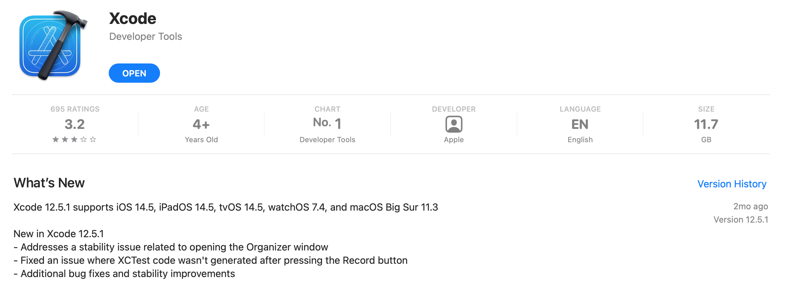

`Desarrollo Mobile` > `Swift Fundamentals`

## Módulo: Swift Fundamentals

Bienvenidos al curso de Programación en Swift.
En este módulo aprenderemos los fundamentos básicos del lenguaje de programación Swift, así como del entorno de desarrollo de Apps en iOS.

### Antes de comenzar...

Primero deberás **descargar Xcode** en tu equipo. Solo abre el link y da click en descargar.

### [Descargar Xcode desde el App Store](https://apps.apple.com/mx/app/xcode/id497799835?l=en&mt=12)

### OBJETIVO 

 - El alumno desarrollará con Swift aplicaciones para iOS altamente optimizadas, ágiles, veloces, interactivas y funcionales. Aprender los fundamentos del lenguaje Swift y del entorno iOS.

### ORGANIZACIÓN DE MÓDULO 
 
 - [Sesión 1](https://github.com/beduExpert/A1-Swift-Fundamentals/tree/master/Sesion-01): Introducción al desarrollo Mobile (ambiente Macos y Swift)  
 - [Sesión 2](https://github.com/beduExpert/A1-Swift-Fundamentals/tree/master/Sesion-02): Swift tools (Xcode, Playgrounds y simulador Iphone)
 - [Sesión 3](https://github.com/beduExpert/A1-Swift-Fundamentals/tree/master/Sesion-03): Storyboard, tu primer hola mundo en Swift 
 - [Sesión 4](https://github.com/beduExpert/A1-Swift-Fundamentals/tree/master/Sesion-04): Estructura básica de Swift(adición y substracción, multiplicación y división, construyendo y compilando app)
 - [Sesión 5](https://github.com/beduExpert/A1-Swift-Fundamentals/tree/master/Sesion-05): Variables y tipos de datos en Swift
 - [Sesión 6](https://github.com/beduExpert/A1-Swift-Fundamentals/tree/master/Sesion-06): Operadores (asignación, aritmético, incremento y decremento, compuestos, comparación, rango y lógicos)
 - [Sesión 7](https://github.com/beduExpert/A1-Swift-Fundamentals/tree/master/Sesion-07): Control de flujos
 - [Sesión 8](https://github.com/beduExpert/A1-Swift-Fundamentals/tree/master/Sesion-08): Integración básica (MVC, IBO, IBA) 

#### Mas información sobre iOS Development: 

[Developer Program](https://developer.apple.com/programs/)

