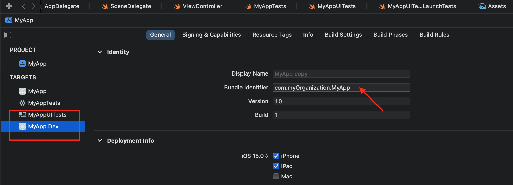

`Desarrollo Mobile` > `Swift Fundamentals`

## Ambiente Xcode, Instalación, Generalidades de Navigator Área, Debugger and Inspector.

### OBJETIVOS 

- Aprender las generalidades del uso de Xcode y Playgrounds.

#### ORGANIZACION DE LA CLASE 

Ejecutar el Ejecutable.
Instalar Developer Tools.

Configurar el ambiente Xcode.
Explorar las partes de Xcode, Navigator, Inspector, Debugger Área.

Explorar los Targets y ubicar las opciones del Nombre del Proyecto, version de iOS, targets.

