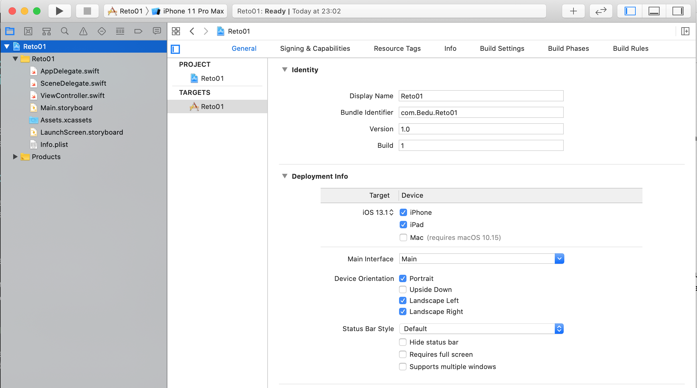
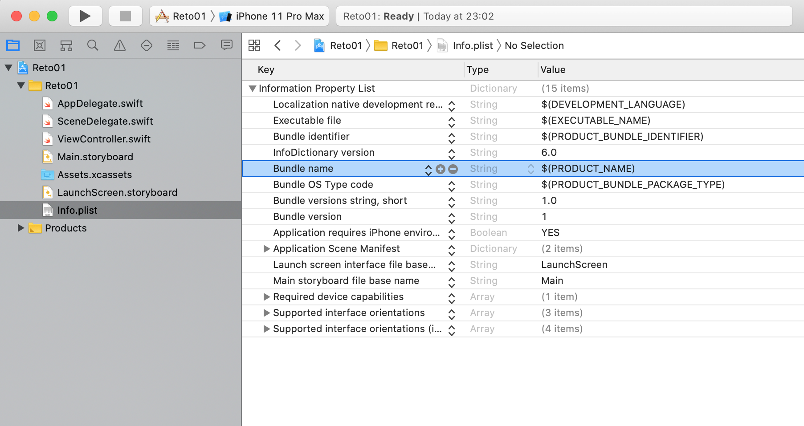

`Desarrollo Mobile` > `Swift Fundamentals`

## Postwork

Cambiar el nombre de la app, las orientaciones soportadas por la pantalla, explorar las demás opciones dentro de esa pantalla. En el archivo .plist investigar para que es Bundle Version, Bundle Identifier y Bundle Name.

### OBJETIVO

- Conocer mas a fondo los elementos básicos de un proyecto de Xcode.

#### REQUISITOS

1. Crear un proyecto simple en Xcode.

#### DESARROLLO

        
Solucion

        
 Crear un proyecto en Xcode, no importa el nombre. Con lenguaje Swift.

        
 Seleccionar el primer archivo dentro del panel Navigator, este nos llevara a los Targets 

        
 Dentro de Targets podemos: 

        
 Cambiar nombre, version de la app, version de iOS, Orientación del dispositivo, Icono de la App, frameworks.

        
 Buscar el archivo info.plist 

        
 Dentro del .plist, agregar un nombre en Bundle Name 

Para desarrollar este Postwork, veamos las siguientes imágenes.

