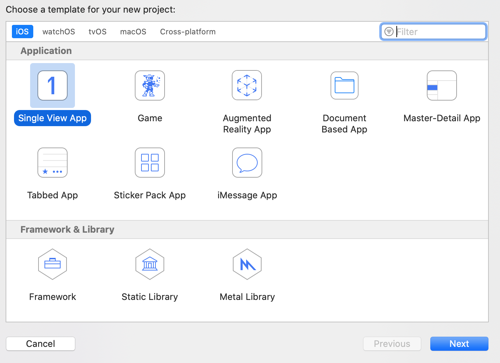
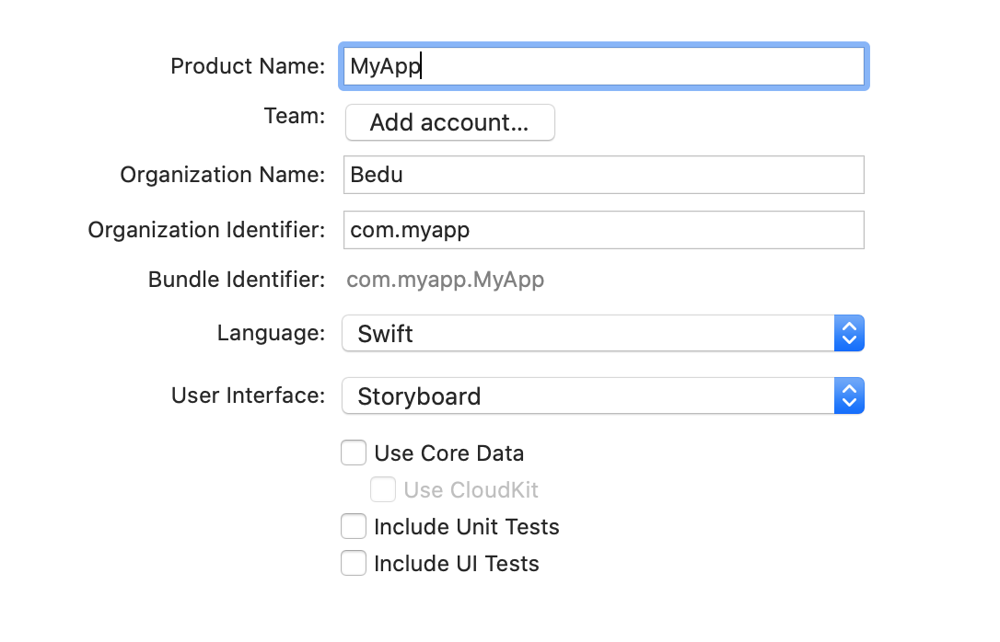
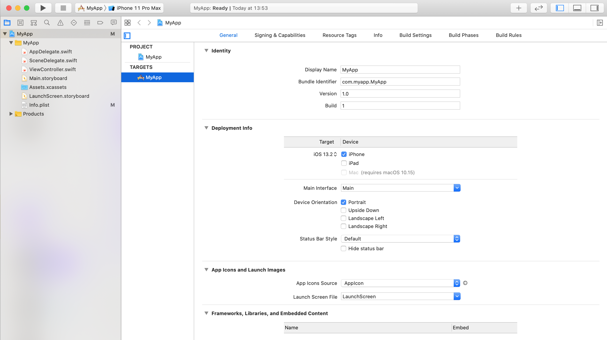

`Desarrollo Mobile` > `Swift Fundamentals`

## Creando un Proyecto Propio en Xcode

### OBJETIVOS 

- Aprender a configurar un proyecto de Xcode, especificando nombre, version de iOS, pantallas soportadas y compatibilidad.
- La idea es comenzar aquí tu proyecto del curso.

#### ORGANIZACION DE LA CLASE 

Crear un proyecto nuevo como **Single View App**.

Especificar nombre y una configuración similar a la mostrada.

User interface debe ser Storyboard.

En la vista de configuración General, aplicar los cambios de versión, nombre, dispositivos, bundle identifier, etc...

