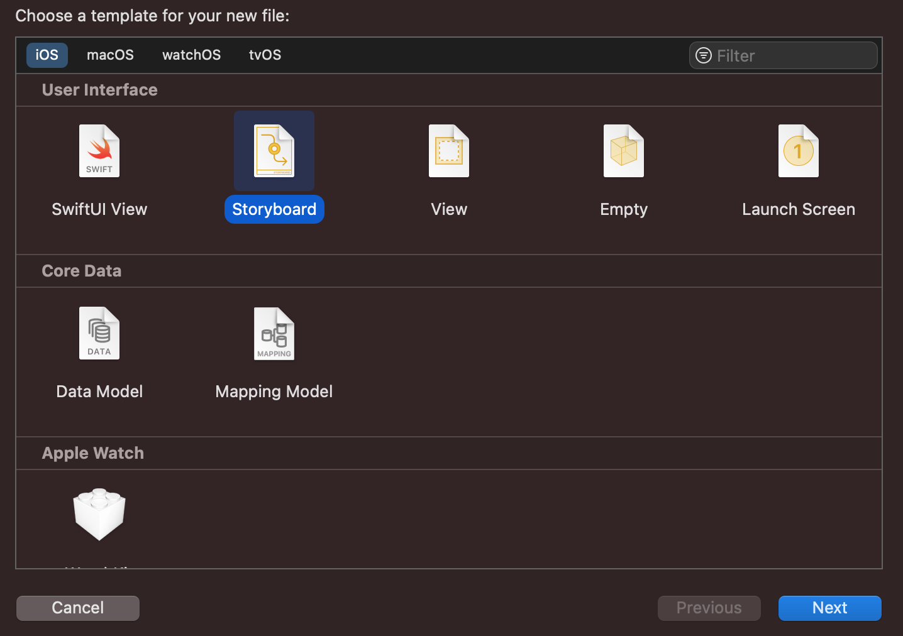
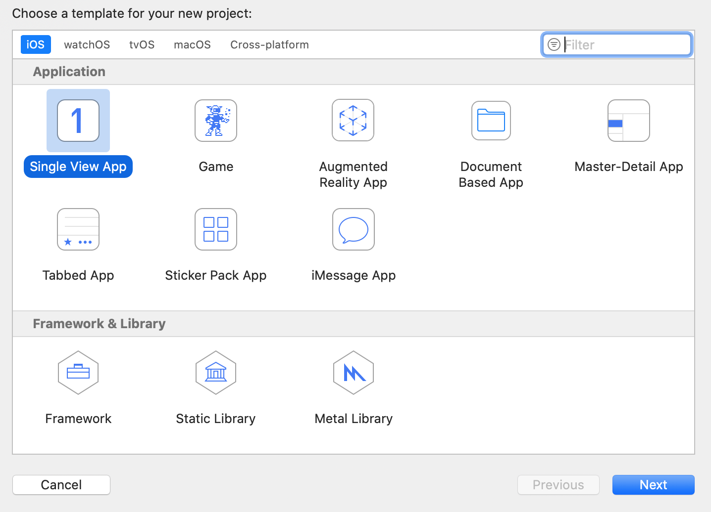
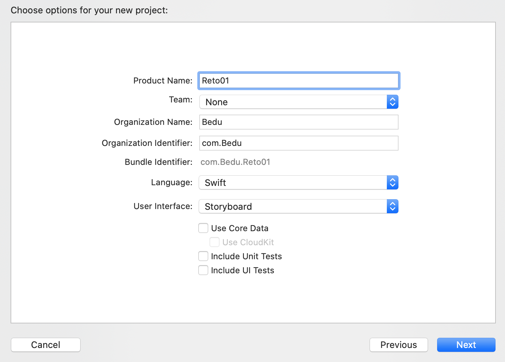
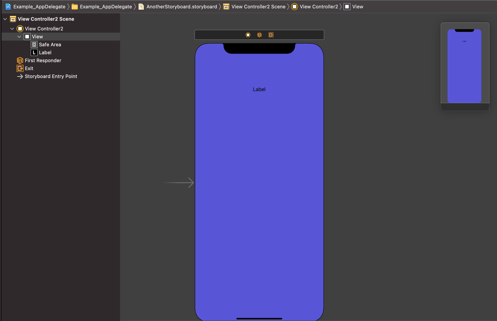

 

`Desarrollo Mobile` > `Swift Fundamentals`
 
	
## Personaliza tu App

### OBJETIVO 

- El alumno podra hacer la configuración inicial de una app. Debe agregar el icono adecuado en tamaño al proyecto.

#### REQUISITOS 

1. Xcode instalado.

#### DESARROLLO

Crear un proyecto en Xcode, simple, sin UITests o UnitTests y sin CoreData con Swift como lenguaje predeterminado.

	
Solución

	
 Se requiere una imágen PNG de 1024x1024, esta es la imágen principal para la App Store 

	
 Se necesita una imágen PNG para dispositivos pequeños conocidos como 2x de 120x120

	
 Se necesita una imágen PNG para dispositivos grandes conocidos como 3x de 180x180

	
 Estas imágnes se agregan dentro de Assets.xcassets dentro de AppIcon en iPhone App 60pt

 

### Secuencia de configuración

