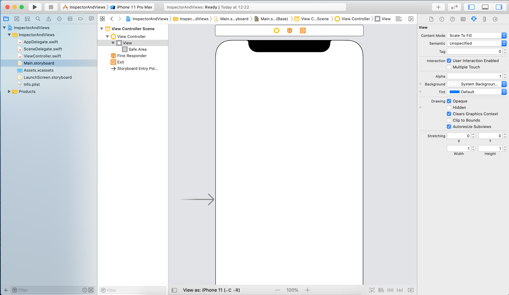
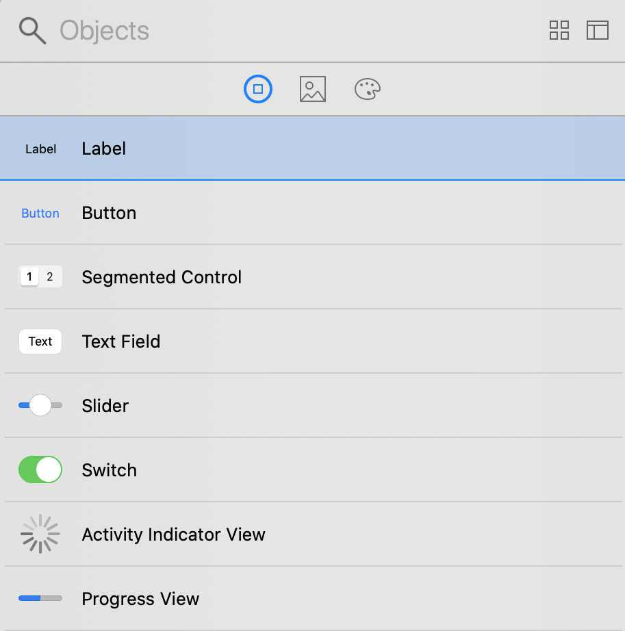
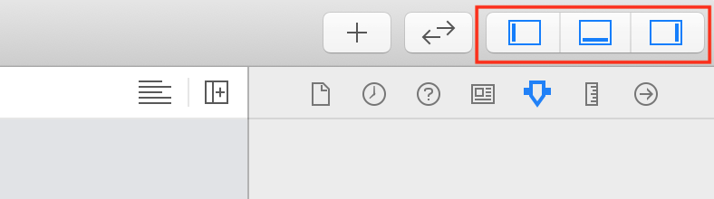
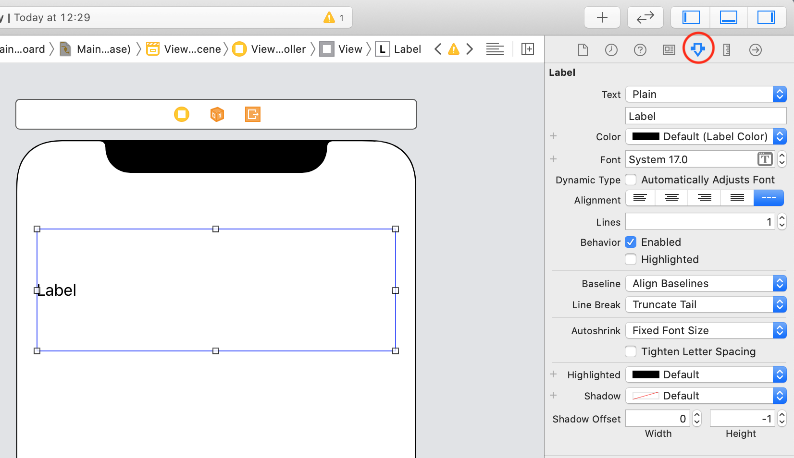

`Desarrollo Mobile` > `Swift Fundamentals`

## Personalización de Vistas mediante el Inspector

### OBJETIVO

- Familizarizarse con los objetos de UIKit y el Inspector de Storyboard.

#### DESARROLLO

1.- Crear un nuevo proyecto `Single View App` en Xcode, con Swift y Storyboard.

Nos dirigimos al Storyboard y vemos una pantalla similar a esta:

En la esquina superior derecha, selecionamos el botón de Library **+**. Con él podemos elegir elementos de UI, buscaremos `Label` y lo arrastraremos a la pantalla.

En la misma esquina derecha, observamos los botones de *Panels*.

El primer panel es el Navigator en donde tenemos nuestros archivos de Swift. El panel del centro es el Debugger en donde podemos ver nuestra consola de Xcode y en el panel de la derecha tenemos el Inspector.

Ahora, teniendo el Label en pantalla y el Inspector, buscamos la opcion *Attributes Inspector*. Dentro de esta opción podemos cambiar el Texto, Color, Tipo de Letra, Alineación del Texto, etc.

