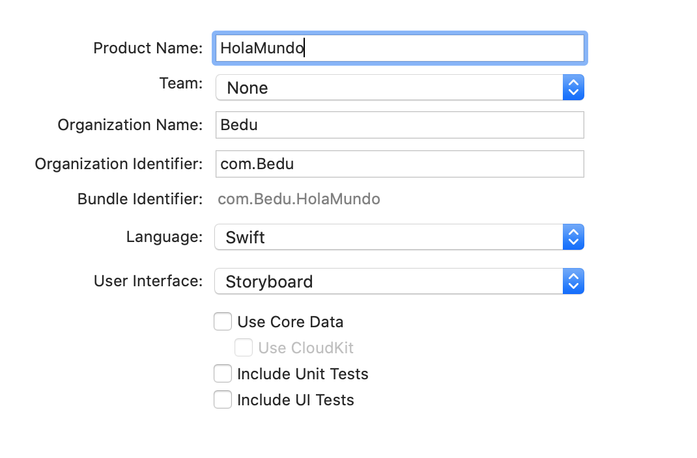
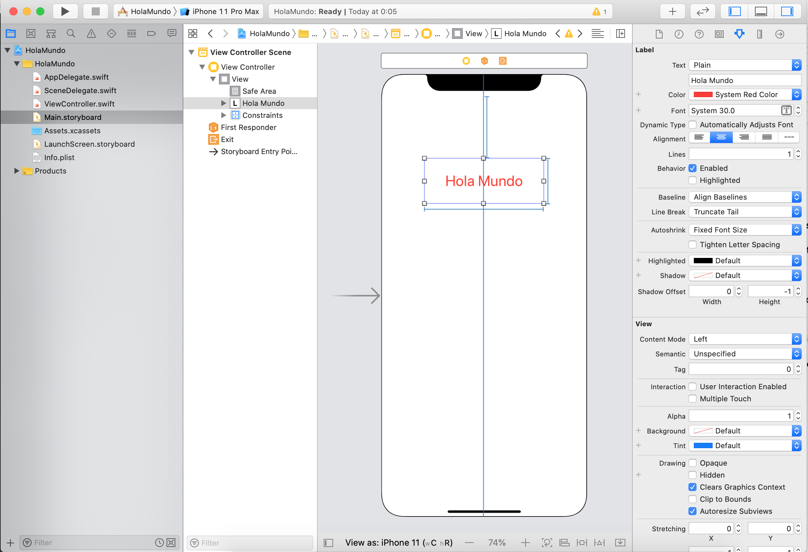

`Desarrollo Mobile` > `Swift Fundamentals`

## Práctica de *Hola Mundo* desde el storyboard.

### OBJETIVO

- Al finalizar esta práctica el estudiante deberá saber como ejecutar una app en el simulador, como utilizar y configurar elementos de UI en el Storyboard.

#### REQUISITOS

1. Crear un proyecto en Xcode con Swift y Storyboard seleccionados.

#### DESARROLLO

1.- Crea un proyecto en Xcode con las opciones como se muestran a continuación:

2.- Abrir el Storyboard, y agregar un UILabel a la vista de ViewController.

3.- Personalizar el label mediante el uso del Inspector.

4.- Ejecutar la App en el simulador.

        
Solucion

        
 El UILabel es agregado mediante el botón de <strong>+</strong> ubicado en la esquina superior derecha, dicho botón es llamado <i>Library</i>. 

        
Al presionar el botón <strong>+</strong>, aparecerá un menú de componentes, buscar UILabel

        
Al tener UILabel, arrastarlo al View, con el cursor ajustar el tamaño y en el inspector agregar un texto y color.

         
Finalmente, ejecutar la App con el botón de Play. 

         
 El resultado debe ser parecido a la sig. imágen. Note que aparecen unas líneas azules, estas líneas ayudaran a especificar una posición al componente.

         

