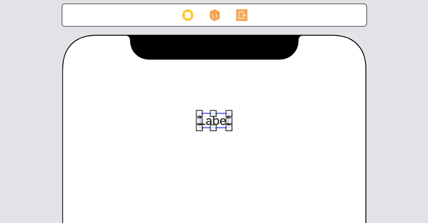
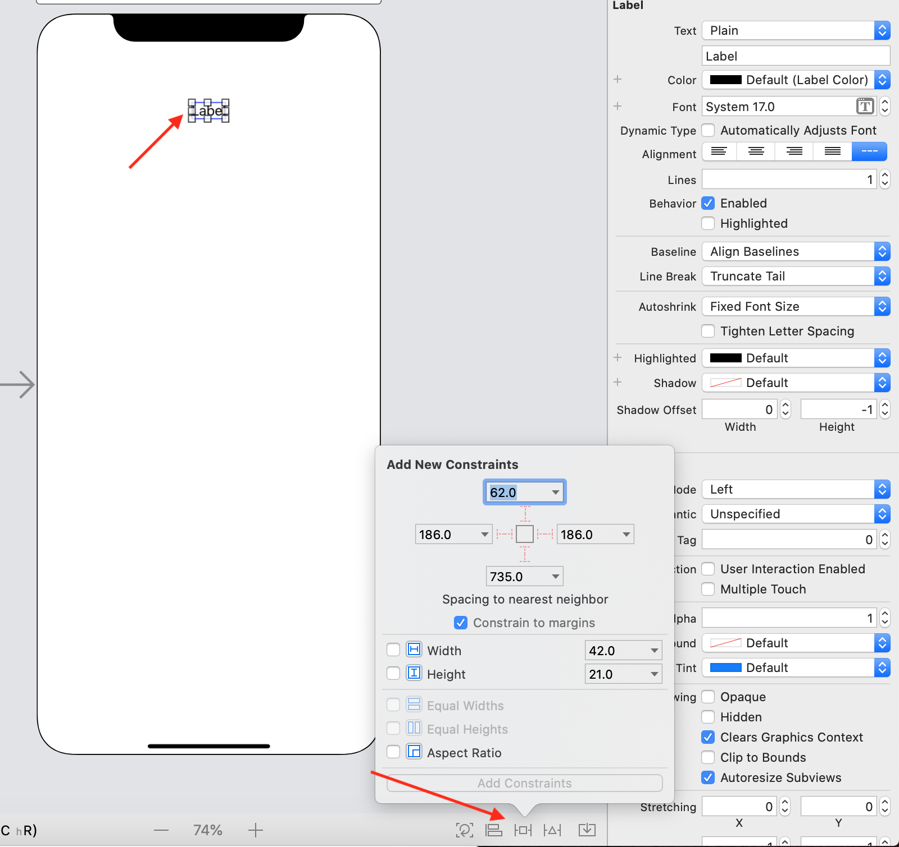
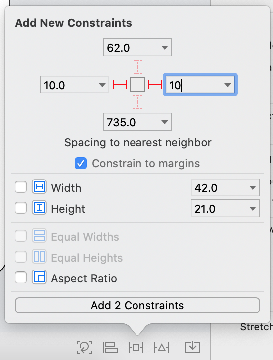
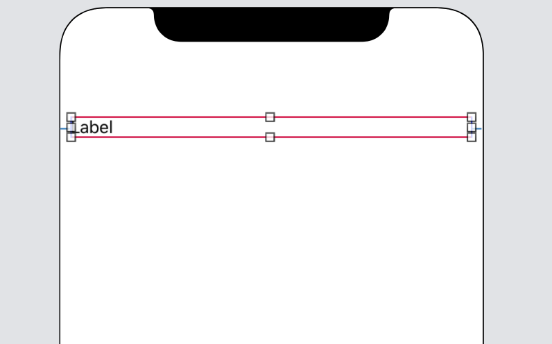

`Desarrollo Mobile` > `Swift Fundamentals`

## Constraints

### OBJETIVO

- Aprender a utilizar los criterios de alineamiento y dimensión de componentes de UI en el Storyboard.

#### REQUISITOS

1.- Crea un proyecto en Xcode como **Single View App**, con las opciones como se muestran a continuación:

#### DESARROLLO

1.- Una vez creado el proyecto, abrir el Storyboard.

2.- Dentro del storyboard, agregar un UILabel.

3.- Vamos a ajustar los constraints, seleccionar el UILabel y observar las opciones en la parte baja del editor.
Tenemos  *Add new constraints*, que nos permitirá agregar constantes de dimensión, altura, ancho y distancias hacia otros elementos.

Agregaremos un valor de 10 en cada lado del UILabel, los agregamos con Add 2 Constraint, como se muestra:

Vemos que el Label cambia de anchura, pero se muestran unas líneas rojas. Esto indica que **faltan** valores por agregar. 

Es importante corregirlos ya que si aparecen lineas rojas nuestra app tendra errores al ejecutarse.

Corregiremos este *error de constraints* dando click en el UILabel, luego ubicar un pequeño círculo rojo en el panel izquierdo.

