`Desarrollo Mobile` > `Swift Fundamentals`

## Constraints y Preview

### OBJETIVO

- Aprender a utilizar los criterios de alineamiento y dimensión de componentes de UI en el Storyboard. Aprender a utilizar el Preview del Storyboard.

#### REQUISITOS

1.- Utilizar el proyecto base del `Ejemplo-04`.

#### DESARROLLO

##### Constraints de alineamiento

Alineando múltiples elementos de UI en un ViewController.

1.- Agregaremos distintos elementos del library y los colocaremos al azar, como se muestra en la sig. imágen:

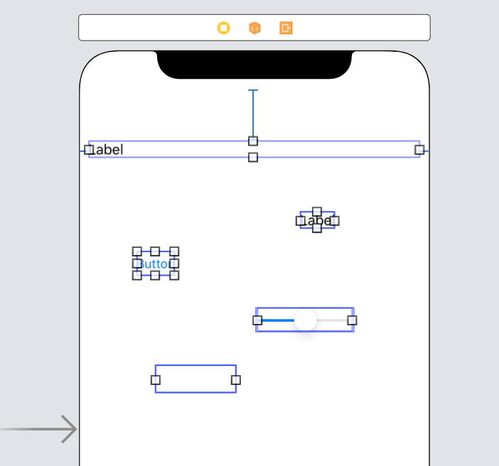

2.- Una vez agregados estos elementos, procedemos a alinearlos.
Seleccionamos todos los elementos agregados, luego ubicamos el botón de *Aling* en la parte inferior. Seleccionamos **Horizontally in Container**.

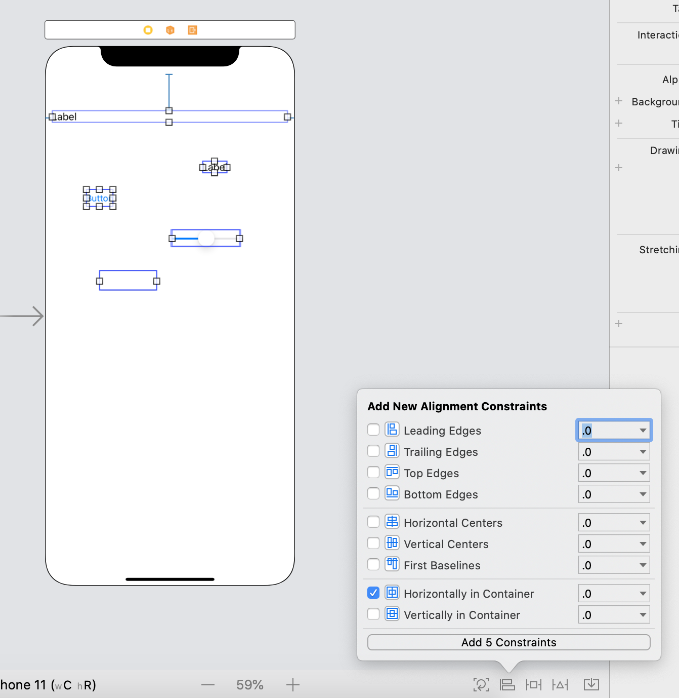

El resultado seria similar a este, note que aparecen líneas rojas de constraints no definidos:

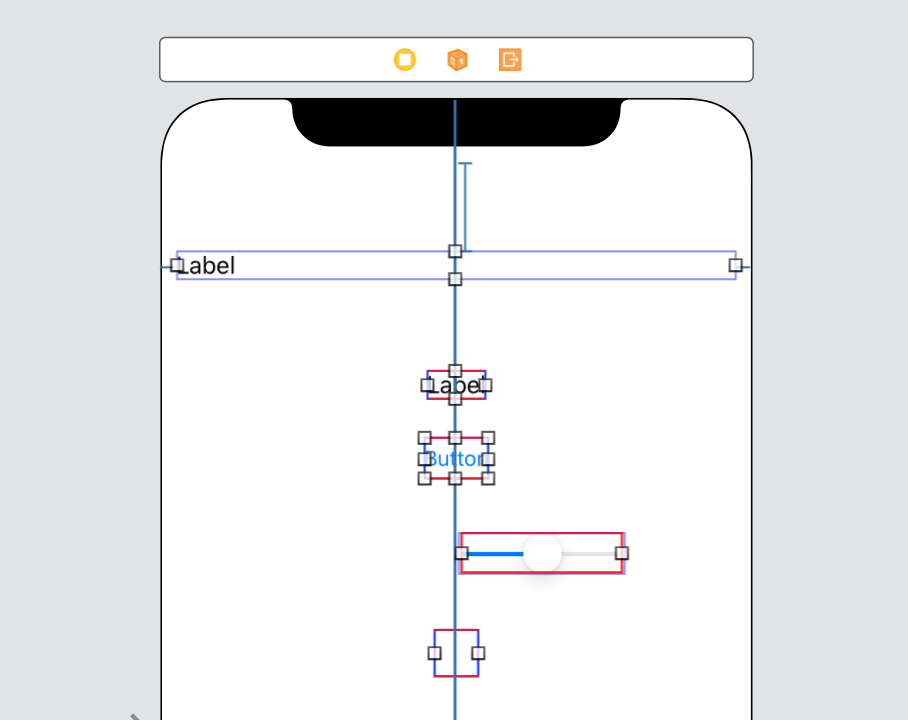

3.- Ahora, se agregarán dos constraints de alineamiento, tanto para la izquierda *Leading* como la derecha *Trailing*. Seleccionamos ambas opciones y damos click en Add.

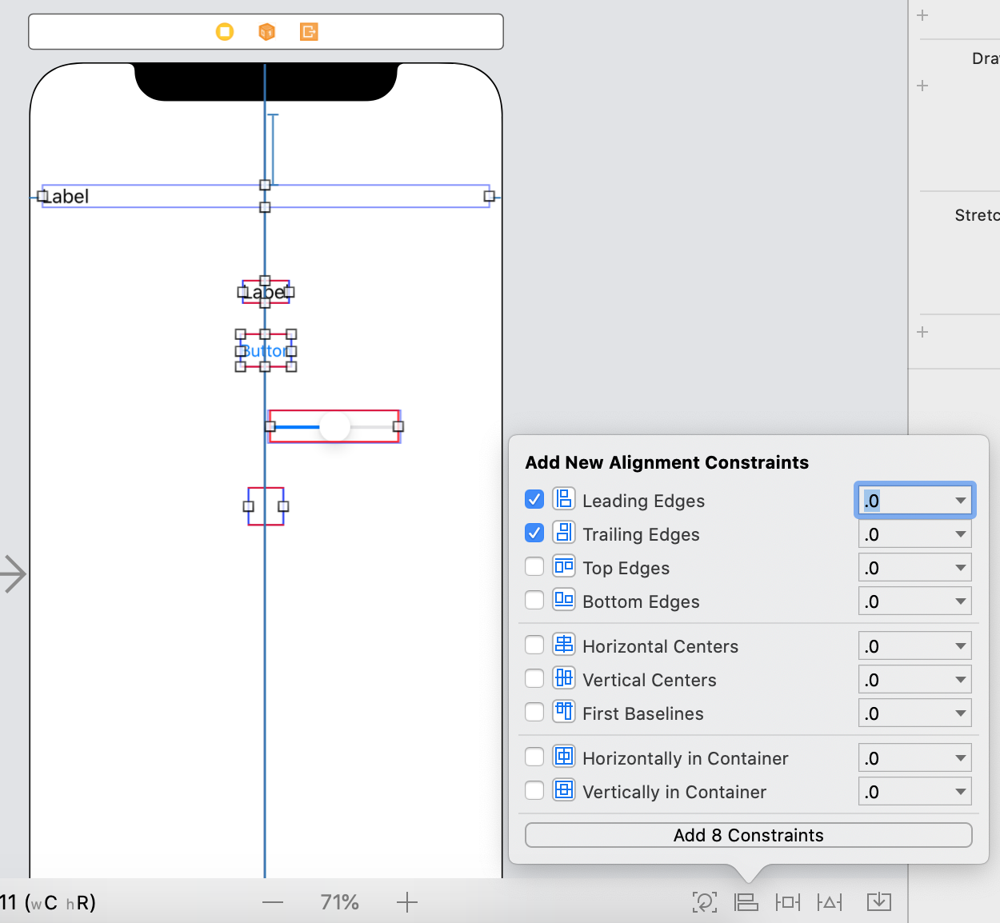

Vemos que se expandieron los elementos, ahora todos estan alineados. Pero aun aparecen constraints no definidos. Estos son espacios y alturas entre componentes. 

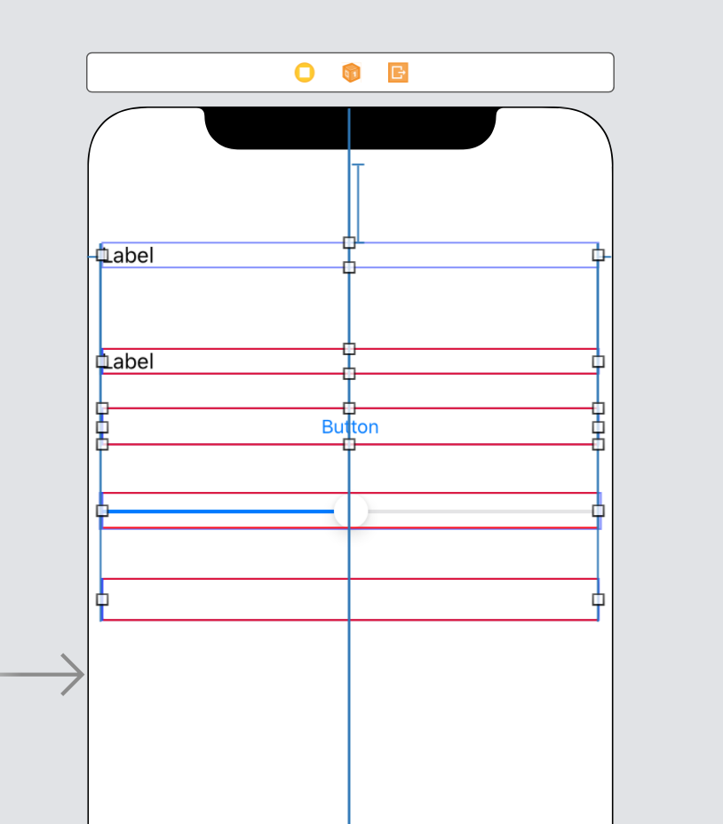

4.- Resolveremos los constraints no definidos como se realizó en el Ejemplo-04, dando click en Add missing constraints.

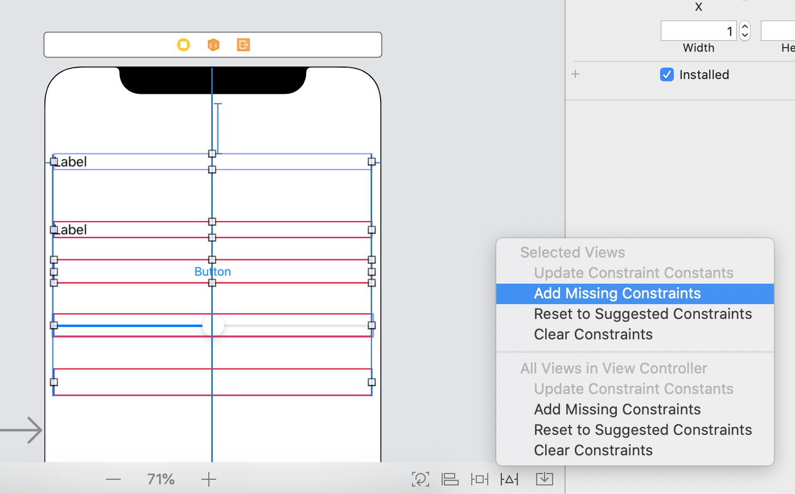

¡Finalmente!

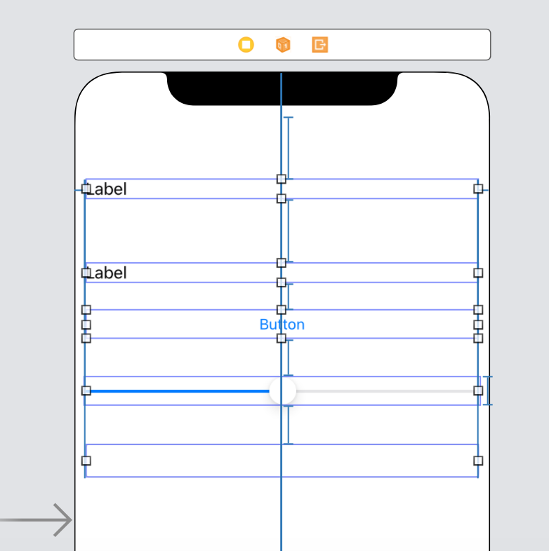

##### Preview en distintas pantallas

Ya teniendo una vista con Constraints configurados, se debe asegurar que se visualizan correctamente en el dispositivo.

1.- Procedemos a activar la vista de Preview. Esta vista nos permitirá Previsualizar los componentes en la pantalla de algún dispositivo iOS.

Dentro del Storyboard, ubicamos el sig. botón y seleccionamos **Preview**.

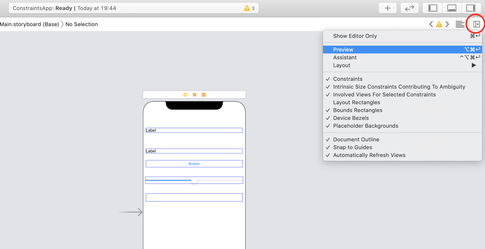

2.- Aparecerá una pantalla parecida a la de edición. Pero en la parte inferior se muestra el Dispositivo al que pertenece dicha vista de previsualización.

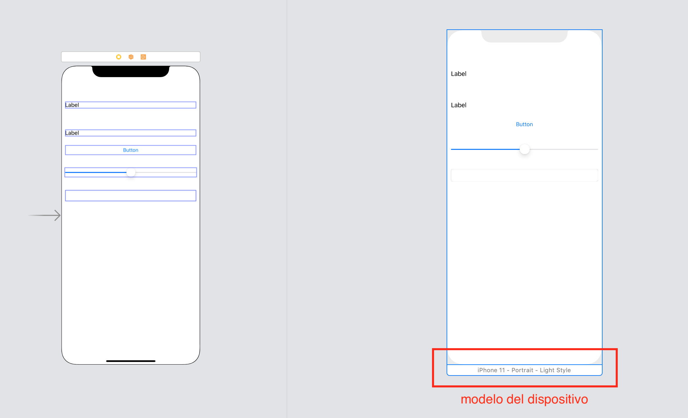

3.- Al dar click en el botón **+** del lado de *Preview*, se pueden agregar mas pantallas. Agregue pantallas a gusto personal.

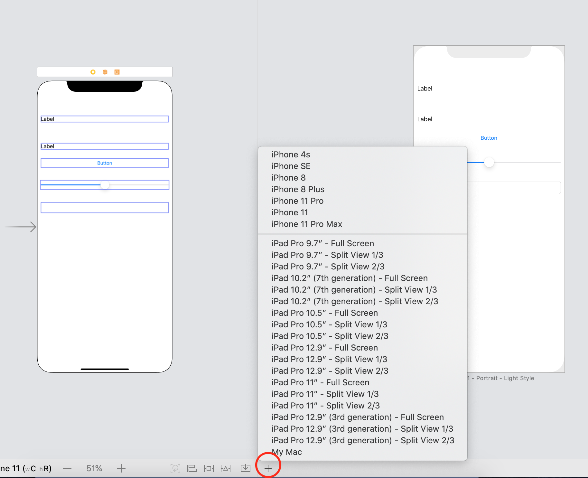

4.- Igualmente es permitido cambiar la orientación de la pantalla a *Landscape*.

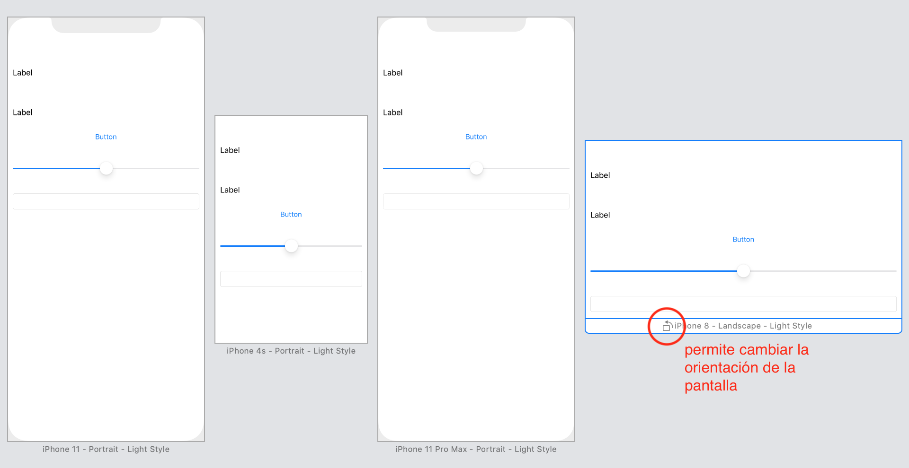

Gracias a Preview podemos asegurarnos que nuestros componentes son visibles en pantalla.

