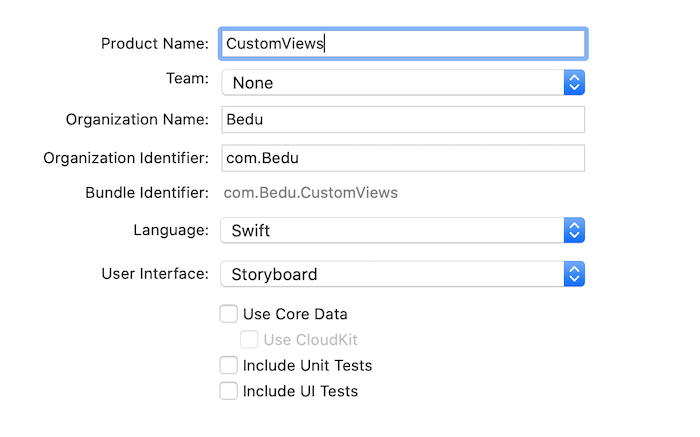
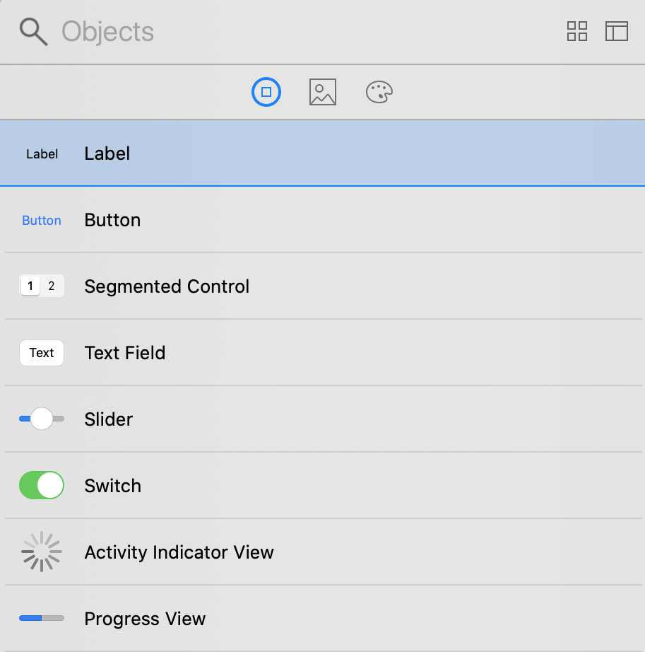
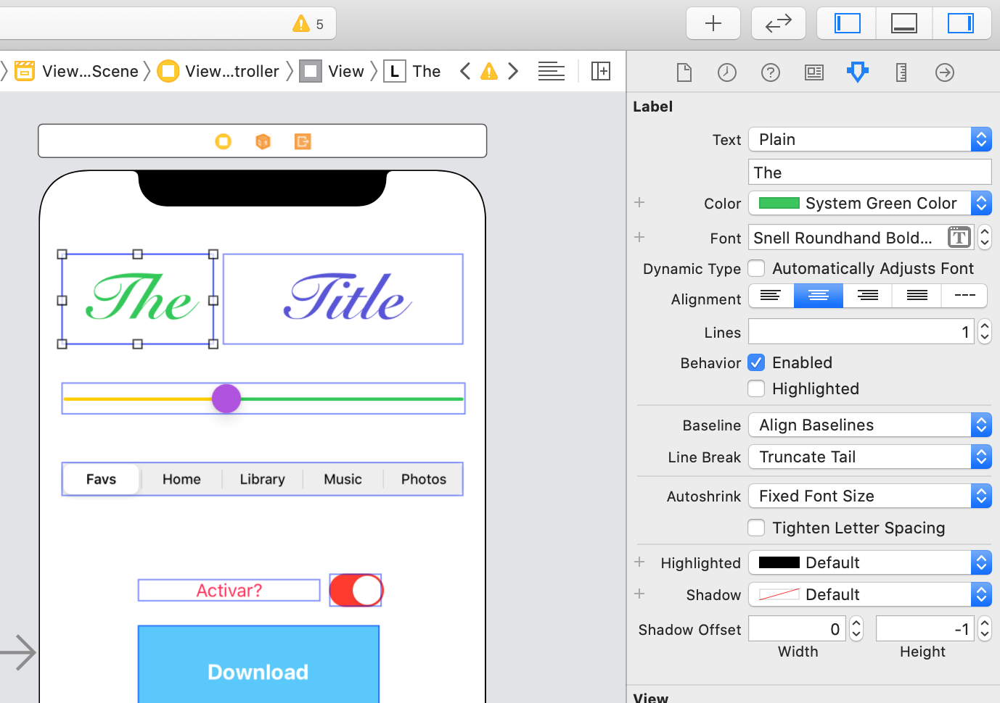
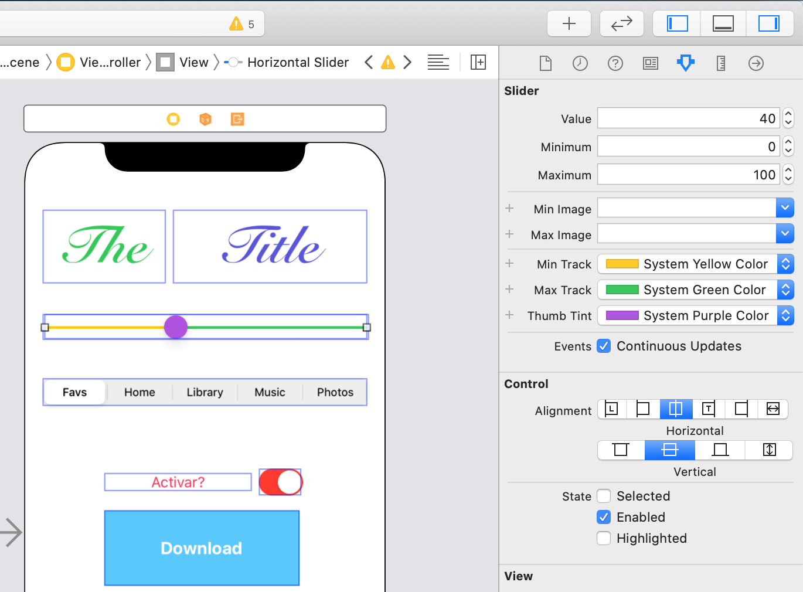
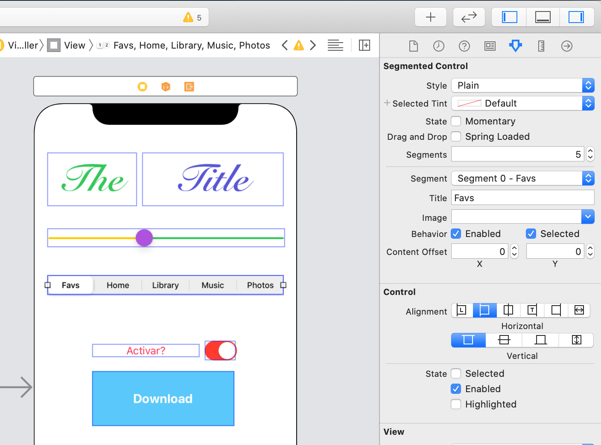

`Desarrollo Mobile` > `Swift Fundamentals`

## Postwork: Personalización de UIObjects

### OBJETIVO

- Familizarizarse a profundidad con los objetos de UIKit y Storyboard.

#### DESARROLLO

1.- Crear un nuevo proyecto `Single View App` en Xcode, con Swift y Storyboard.

2.- Ir al Storyboard y agregar elementos del Library. Podemos agregar elementos como Label, Button, Switch, etc.

3.- Intenta recrear algo similar a esto:

        
Solución

        
 Para personalizar un componente de UI en el Storyboard, debemos apoyarnos del Inspector. Las opciones dentro del Inspector cambian de acuerdo al elemento seleccionado. 

        
 Por ejemplo, al seleccionar el Label, las opciones serian: 

        
        
 Veamos ahora como cambian al seleccionar el <strong>Slider</strong>: 

        
        
 Bien, ahora seleccionemos el Segmented Control, vemos que aqui las opciones cambian aun mas. Tenemos Segments y Segment(menú), en el primero indicamos el número de opciones a mostrar y en el segundo configuramos cada opción.

        

#### ¿TERMINASTE EL POSTWORK?

Investigar:  
¿A qué se le llama `InterfaceBuilder`?

¿Qué es `IBInspectable` y`IBDesignable`?

Lectura breve (EN)
[medium.com](https://medium.com/@nimjea/ibdesignable-and-ibinspectable-in-swift-c12ea557b82b)

### Algo adicional...

Para tu proyecto final sería increíble incluir una manera más avanzada para personalizar tus componentes. Busca en esta carpeta el archivo en swift llamado `CustomButton.swift` y agrégalo a tu proyecto.

        
Solución

        
 Una vez agregado el archivo al proyecto, procedemos a asignarlo a un Botón. Damos click en el UIButton azul que tenemos y en el inspector agregamos la clase. 

        
 Esta clase permitirá agregar esquinas redondeadas a tu botón.

        

¿Quieres saber más?, visita: [supereasyapps.com](https://blog.supereasyapps.com/how-to-create-round-buttons-using-ibdesignable-on-ios-11/)

