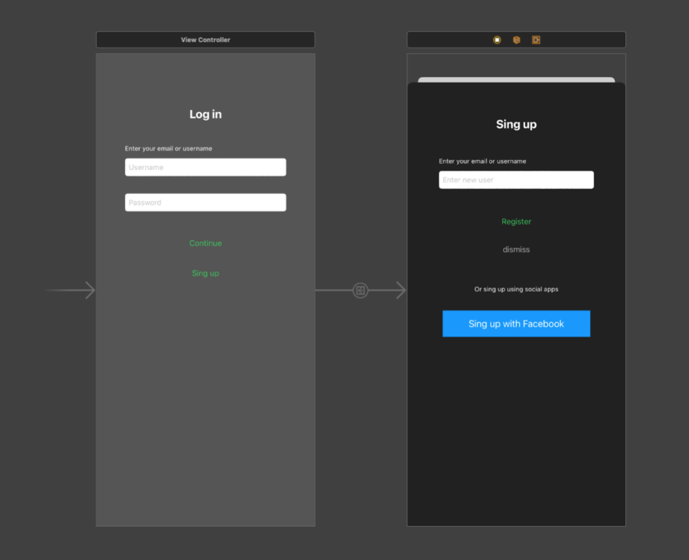
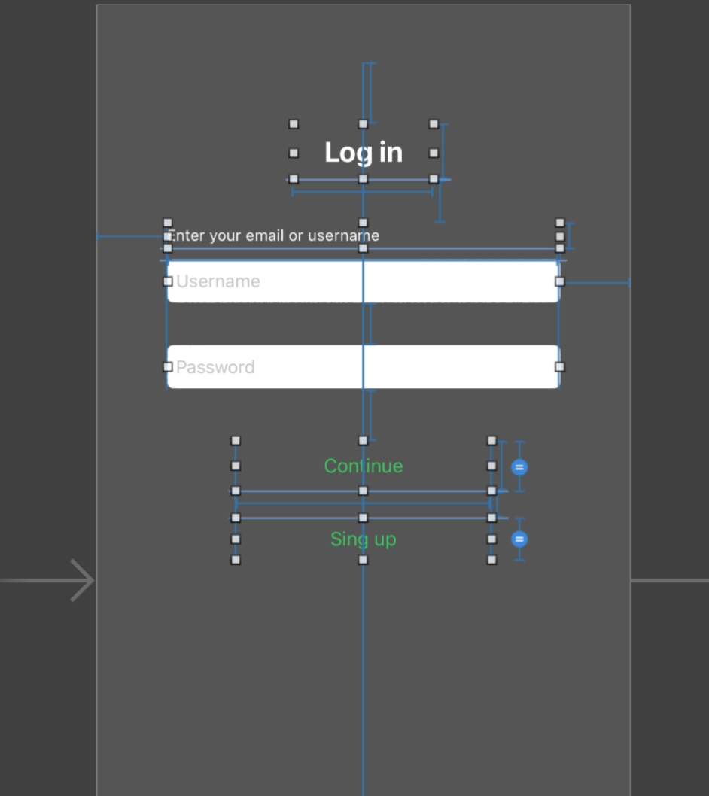
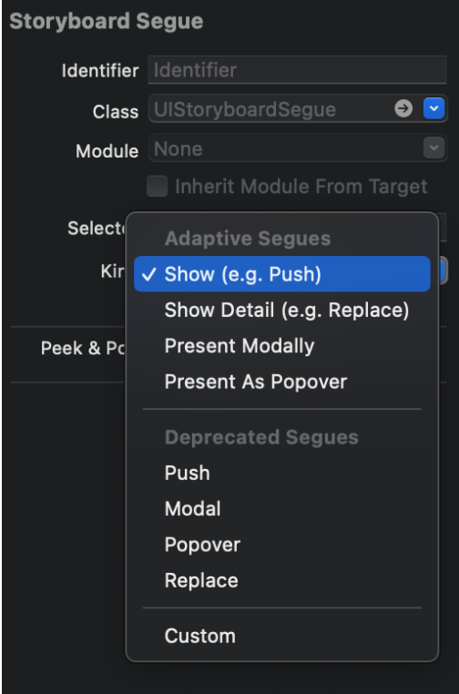

`Desarrollo Mobile` > `Swift Fundamentals`

## Postwork: Tu Primera App

### OBJETIVO

- Creación de un flujo de navegación mediante Storyboards con el objetivo de reforzar las sesiones e integrar los ejemplos vistos en el proyecto final.

- Al terminar la creación del flujo de navegación, agregar constraints y personalización.

#### DESARROLLO

Comenzamos el Postwork definiendo el resultado esperado. 

Como se puede apreciar en la sig. Imágen, el proyecto consiste en dos vistas, una de LogIn y otra de Sign Up.  

Ambas poseen elementos de UIKit y para navegar a la vista de SignUp será por medio del botón en la vista de LogIn, esto por medio de una acción Push.

Para la pantalla de Log In, agregaremos un Label en la parte superior a manera de título. Podemos usar este componente como base para alinear las distancias con el siguiente Label que lleva como texto “Enter your email or username”. Los valores de las dimensiones son abiertas al desarrollador, al igual que los colores.

Nota: En Storyboard es muy común caer en redundancias, es decir, agregar constraints innecesarios o duplicar valores. En caso de llegar a duplicar un constraint, simplemente lo borramos haciendo click sobre él y presionando la tecla delete (backspace).

Por último y no menos importante, para navegar de una vista a otra sugerimos usar el modo modal de Show o Push.

