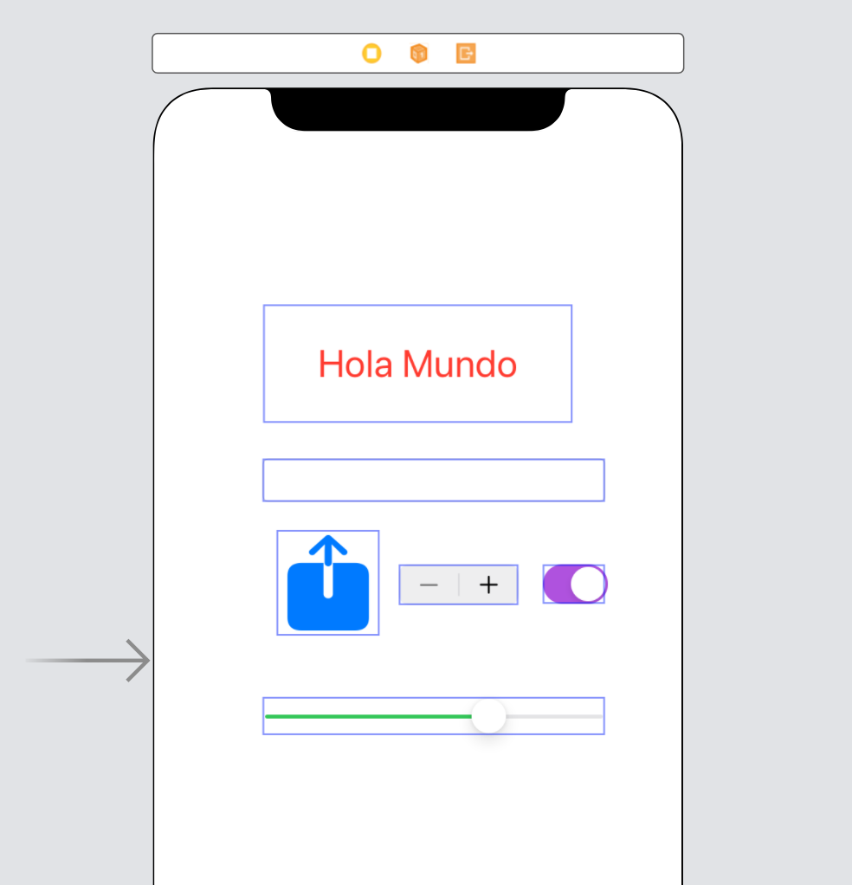

`Desarrollo Mobile` > `Swift Fundamentals`

## Personaliza tu Primera App 

### OBJETIVO 

- Personalizar mas elementos de UI e identificar sus opciones en el inspector

#### REQUISITOS 

1. Proyecto de *HolaMundo* terminado (Ejemplo 02).

#### DESARROLLO

1. Utilizar el proyecto de Hola Mundo.
2. Agregar elementos del Library, se sugieren Sliders, Switch, TextFields.
3. Personalizar estos componentes.

	
Solucion

	
 Con base en el proyecto de Hola Mundo, abrir el Storyboard 

	
 En el Storyboard, ir a **Library [ + ]** y arrastrar los elementos de UI que el alumno guste. 

	
 Con el uso del Inspector, personalizar estos componentes. Intentar recrear algo parecido a esto: 

	

 

