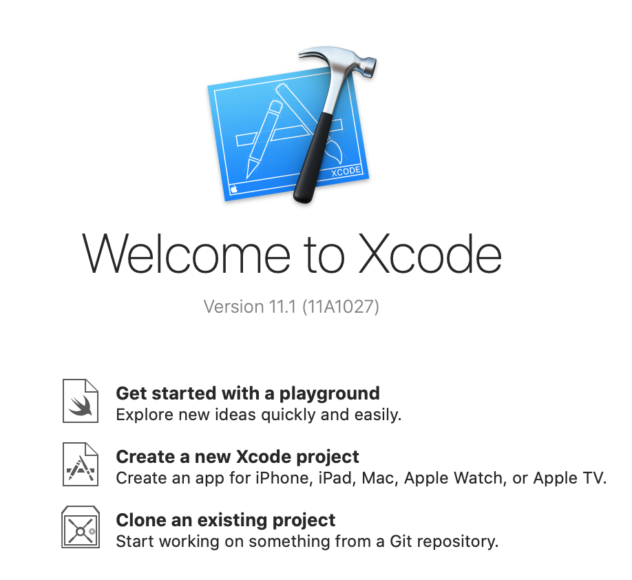
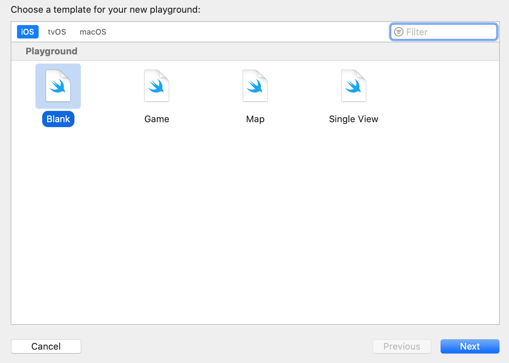

`Desarrollo Mobile` > `Swift Fundamentals`


## Jerarquía de operadores

### OBJETIVO

- Aprender como es la jerarqúia de operaciones matemáticas en Swift.

#### DESARROLLO

1.- Crea un nuevo proyecto de Playground. Nombralo `Jerarquias`.





2.- De acuerdo a la lectura de [Jerarquía de Operaciones](https://www.ditutor.com/numeros_naturales/jerarquia_operaciones.html), realizar los siguientes ejemplos en el [Playground](Jerarquia.playground).

```
let resultado = 9 - 7 + 5 + 2 - 6 + 8 - 4
print(resultado) // 7
```

3.- Realizar lo mismo, pero con las operaciones:

> 3 * 2 - 5 + 4 * 3 - 8 + 5 * 2
> 
> 6 - 5 + 12 - 8 + 10
> 
> 5 + 15 + 4 - 10 - 8 + 8 - 4
> 
> 10 / 2 + 5 * 3 + 4 - 5 * 2 - 8 + 4 * 2 - 16 / 4
> 
> (15 - 4) + 3 - (12 - 10) + (5 + 4) - 5 + (10 - 8 )
> 
> (15 - (8 - 5 )) * (5 + (6 - 4 )) - 3 + (8 - 6 )
> 
>  (1 * 256) + (1 * 128) + (0 * 64) + (1 * 32) + (0 * 16) + (0 * 8) + (1 *
4) + (1 * 2) + (1 * 1)
