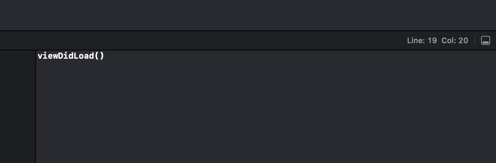
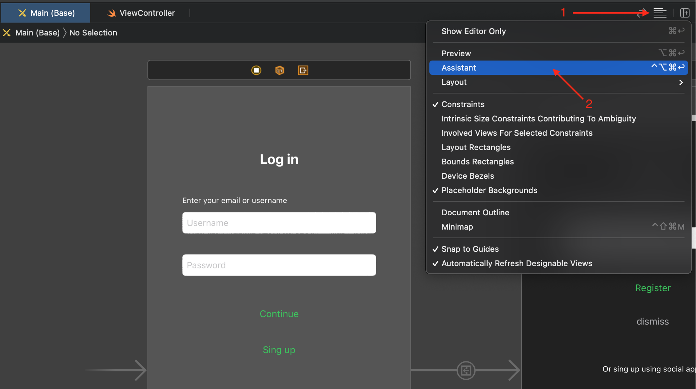
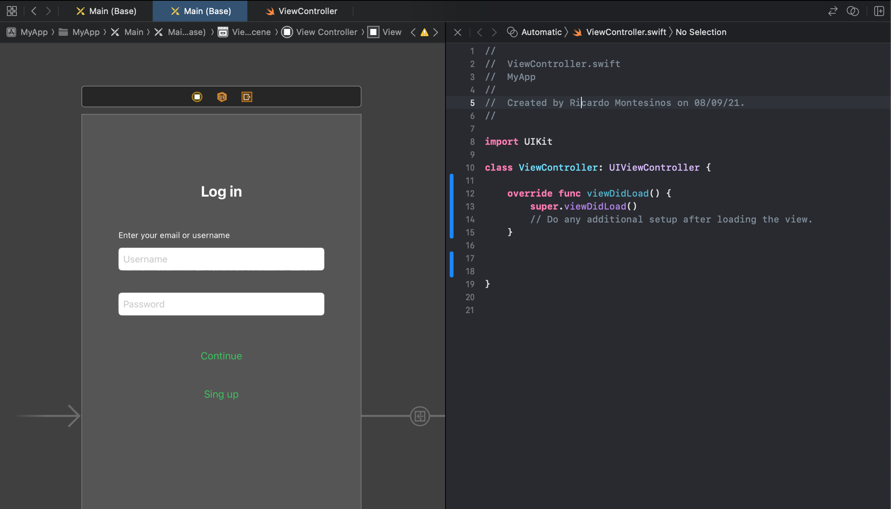
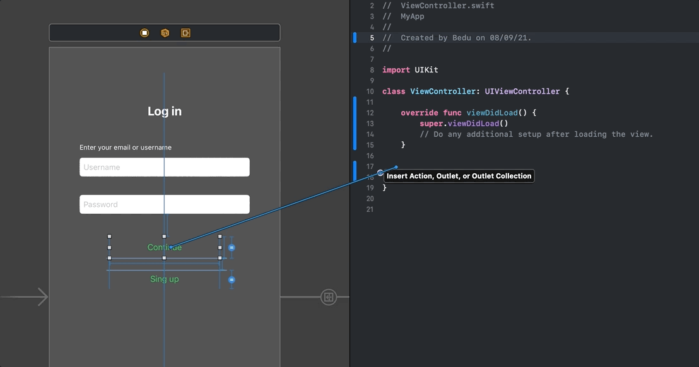
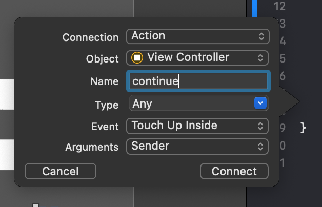
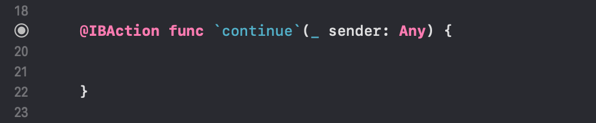
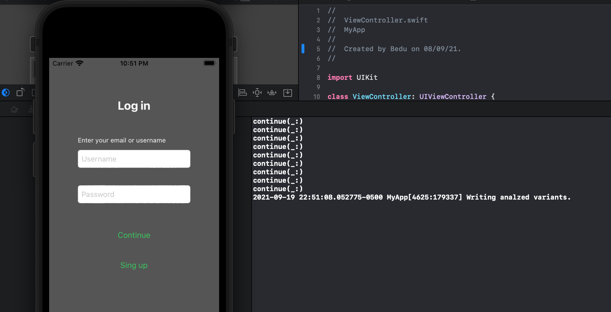

`Desarrollo Mobile` > `Swift Fundamentals`

## :wave: Sesión 4: Estructura básica del lenguaje Swift  

### OBJETIVO

- Implementar los temas de sintaxis basico en el proyecto final.
- Conectar elementos de Storyboard con Swift.

#### REQUISITOS

1. Proyecto de la sesión 03 funcionando.

#### DESARROLLO
 
Como aprendimos en el ejemplo de funciones, tenemos la siguiente sintaxis:

> func function_name(parameters) { }

Claro que hay variantes de esta sintaxis, por ejemplo agregar parametros con valores por defecto como:

> func myNameis(name: String = "Bedu") { }

En esta función, asignamos un parámetro de tipo String, que por defecto tendrá el valor de "Bedu".

Al implementar esta función, podemos usarla como sigue:

> myNameis(name: "Ricardo")

Bien, en varios proyectos de programación es común el uso de la función `print()`. En este postwork implementaremos una función de tipo print que permita saber que funcion se esta ejecutando del proyecto, es decir, cuando se ejecute la función *viewDidLoad* debemos mostrar en la consola un mensaje como este:

Y este comportamiento debe repetirse en cada función que declaremos.

Te daré una pista, en Swift existe la siguiente palabra reservada: `#function`. Al usarla, esta retornará el valor de la función en donde se encuentre, el valor será de tipo String.

Por ejemplo: 

> let name: String = #function

Entonces, ¿que haremos?, implementar una función que permita imprimir en consola el nombre de la función que esta ejecutando.

**Una vez terminada esa tarea,** procederemos a crear IBActions. Estos son funciones que se conectan directamente con los elementos de UIKit en el Storyboard.

Nos dirigimos a nuestro Storyboard y ubicamos el icono de lineas horizontales, damos click sobre este y varias opciones de visualización seran mostradas. Elegimos Assistant.

La vista se mostrará de la sig. manera:

Esta opción de Assitant divide la pantalla entre Storyboard y editor de código. Gracias a esta función podemos conectar elementos de UIKit con Swift.

Procedemos a dar un ejemplo, dando click sobre un botón arrastramos a la pantalla de editor de codigo mienras presionamos la tecla `control`. Debe mostrarse una linea azul:

Un pop-up emergerá, aqui ingresaremos el nombre de nuestra función. Y finalmente damos click en `connect`.

Una función debe aparecer con el nombre que le asignemos y con la palabra `IBAction` al inicio:

¿Recuerdas la primera tarea?, dentro de esta función agregaremos dicha función para mostrar en consola que función estamos ejecutando.

1.- Procederemos a realizar la misma acción con ambos TextFields.

2.- Crearemos una función que tenga como parámetro un valor String y de retorno un Booleano. Dentro de esta función compararemos si el valor tiene una longitud mayor a alguna especificada, por ejemplo, si esta longitud es mayor a 10 caracteres.

3.- El resultado de este valor debe mostrarse en consola acompañado de un mensaje de `print()`.

