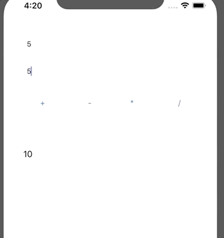

`Desarrollo Mobile` > `Swift Fundamentals`

## Calculadora simple en Swift

### OBJETIVO

- Con lo aprendido hasta el momento, crear una calculadora utilizando UILabel, UIButton y UITextField.

#### REQUISITOS

1. Basarse en el proyecto `Calculator-Starter`.

#### DESARROLLO

1.- Crear un layout de calculadora parecido a este:

2.- Se deberán de poder hacer cálculos ingresando dos números.

3.- Las operaciones esperadas son suma, resta, multiplicación y división.

4.- El resultado final debe mostrarse en un Label.

5.- En caso de dividir entre 0, mostrar msj. de error en el Label.

