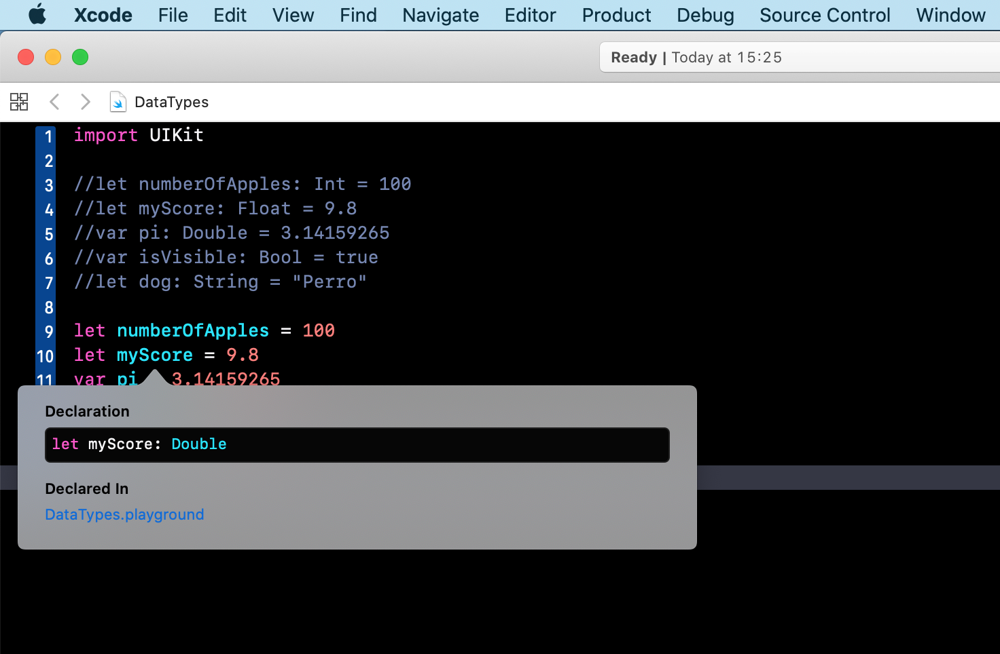

`Desarrollo Mobile` > `Swift Fundamentals`


## Tipos de datos

### OBJETIVO

- Las variables y constantes necesitan guardar información, sin embargo esta información es de muchos tipos. En este tema se aprenderán los diferentes tipos de datos disponibles en Swift.

#### REQUISITOS

1. Concluir la lectura de Tipos de datos de la sesión 4.

#### DESARROLLO

Un tipo de dato puede ir desde un número Entero hasta un Tipo de dato creado por el Programador.

* Datos Primitivos, tipos de datos básicos:

	- **Int**, permite a la variable o constante almacenar un número entero, ej. 1,2,3,4,5,6..., este número entero es de 32 bits con un rango de entre -2.147.483.648 y 2,147,483,647.
	- **Float**, para almacenar algún valor con decimales, ej. 3.1416 utilizamos un tipo flotante, este tipo de dato es de 32 bits con hasta 6 decimales de precisión.
	- **Double**, para decimales mas largos, podemos utilizar un tipo Double con hasta 15 decimales de precisión.
	- **Bool**, número booleano que puede ser 0 (false) o 1 (true).
	- **String**, cadena de caracteres, tratada internamente con una matriz (array) de ellos.


Ahora bien, crearemos en el Playground una variable con los tipos de datos mencionados.

```
let numberOfApples: Int = 100
let myScore: Float = 9.8
var pi: Double = 3.14159265
var isVisible: Bool = true
let dog: String = "Perro"
```

Swift tiene la capacidad de Inferir de que tipo de dato se trata, ahora, escribe las variables sin el tipo de dato:

```
let numberOfApples = 100
let myScore = 9.8
var pi = 3.14159265
var isVisible = true
let dog = "Perro"
```

Tip: Posicionar el cursor sobre el nombre de la variable, y presiona la tecla `option-alt` y da click. Aparecerá una *pop-up* que indicará que tipo de dato *infiere* Swift.




