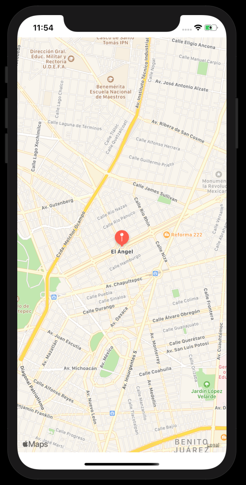
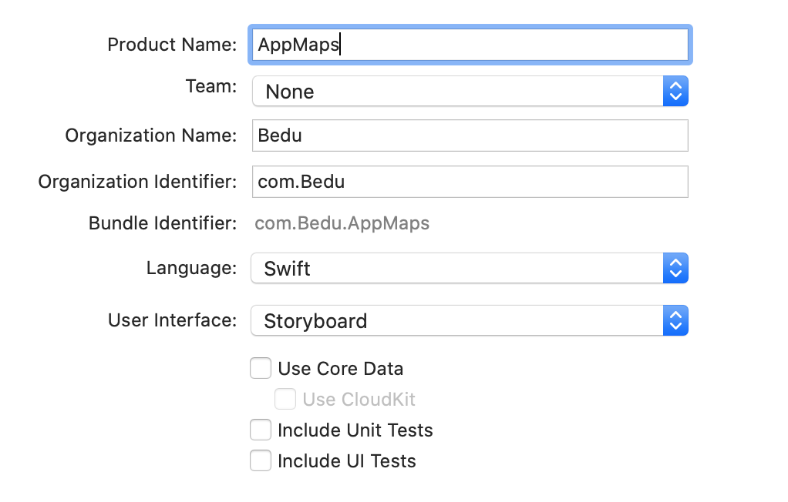
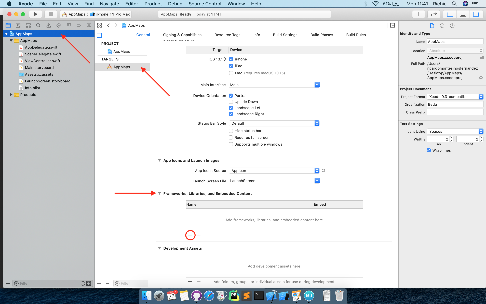
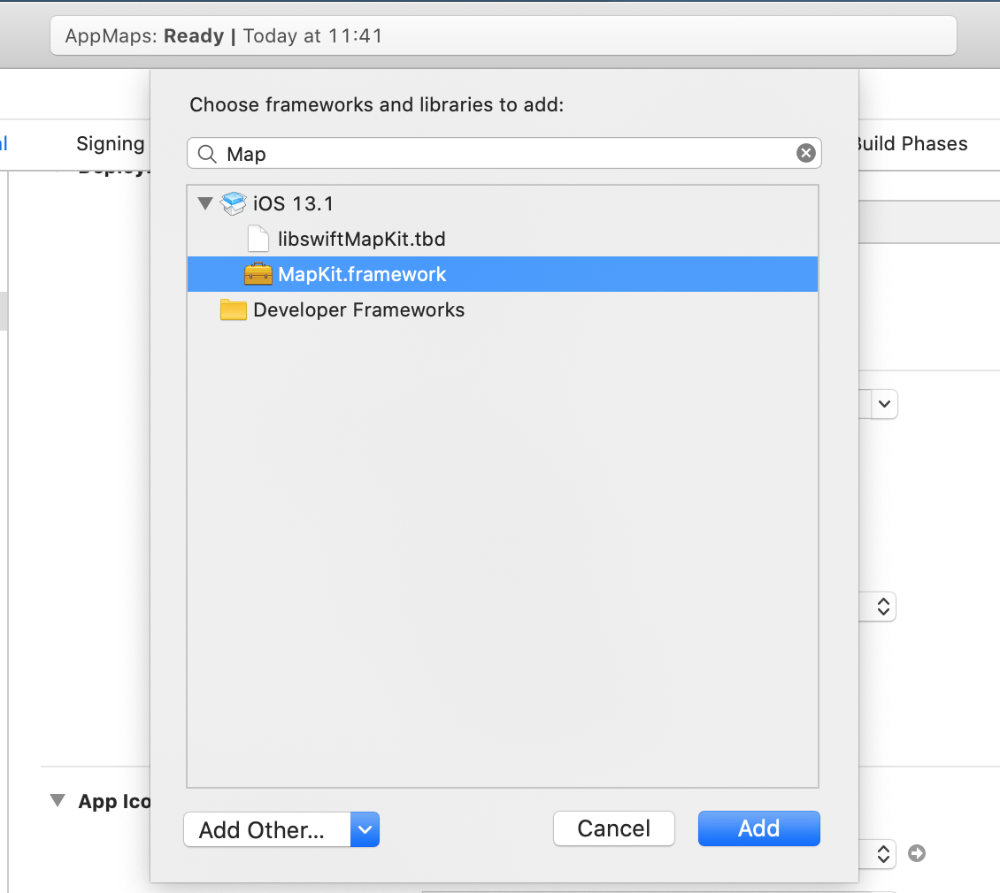
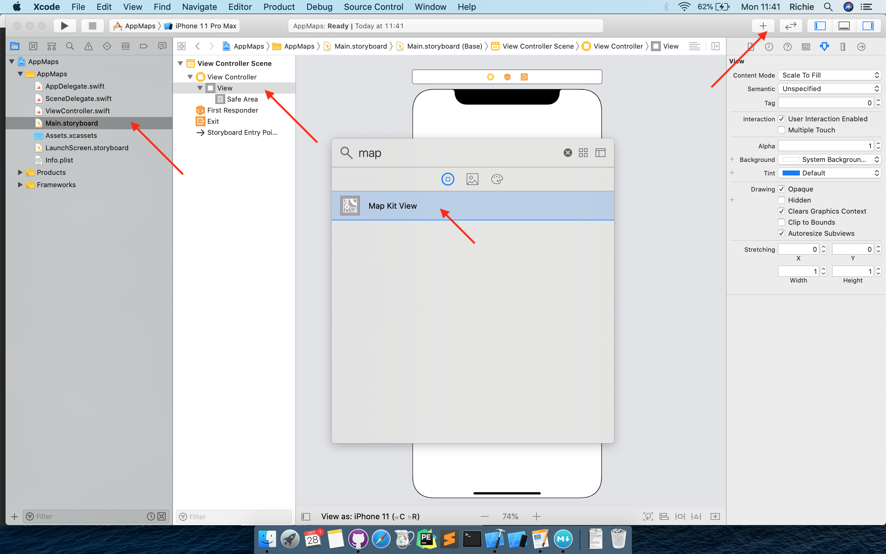
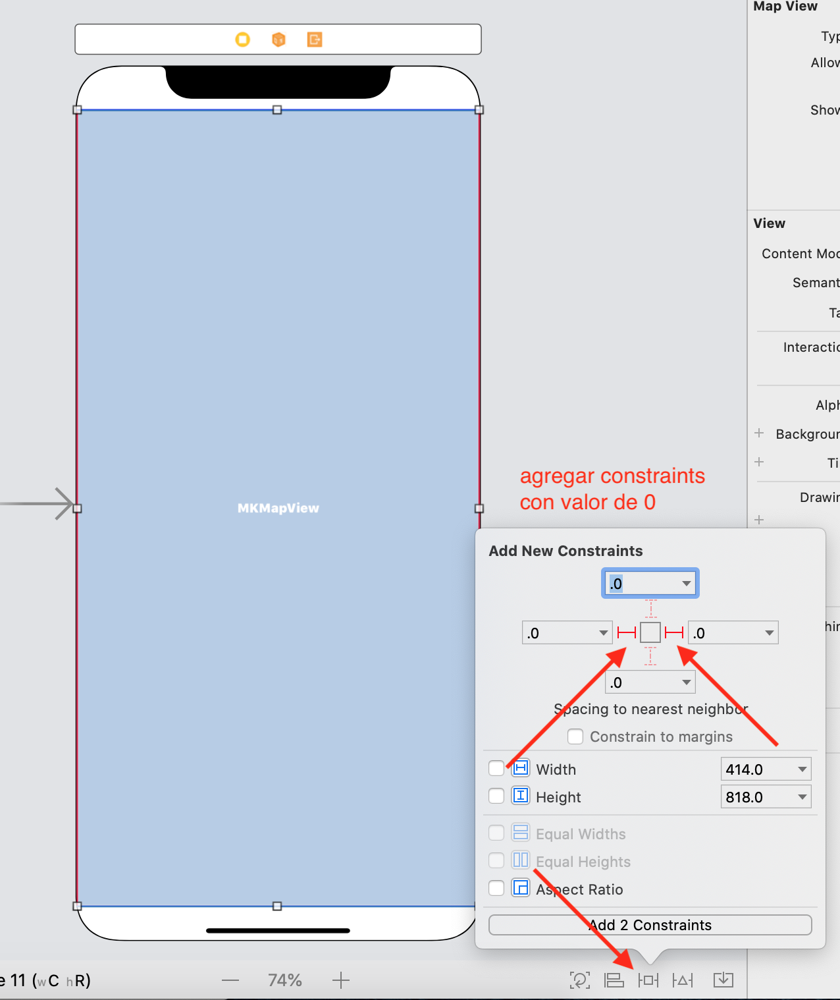
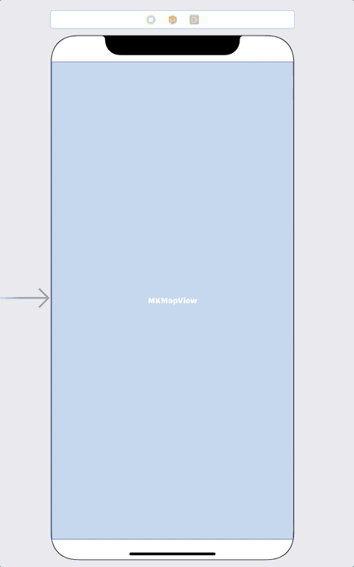

 

`Desarrollo Mobile` > `Swift Fundamentals`
	
## App de Maps 

### OBJETIVO 

- Utilizar los conceptos de variables, constantes, tipos de datos y tuplas.

#### REQUISITOS 

1. Xcode instalado.

#### DESARROLLO

El proyecto a desarrollar será una app de Mapas en donde se mostrará una ubicación.
Las coordenadas deberán estar basadas en tuplas.

</img>


1.- Crear un nuevo proyecto de Xcode como **Single View App**, con Swift y playgrounds.




2.- Agregaremos el Framework de Mapas, nos dirigmos a la ventana de conf. del proyecto, buscamos *Frameworks* y agregamos *MapKit.framework*.





3.- Nos dirigimos al Storyboard y ahi agregaremos (arrastrando al view controller) un elemento de Mapa, *Map Kit View*.




4.- Agregamos los constraints para que se ajuste a la pantalla.




5.- Conectamos el **MKMapView** con el archivo **ViewController.swift** y agregamos el framework.


```
import UIKit
import MapKit //framework

class ViewController: UIViewController {

  @IBOutlet weak var mapView: MKMapView!
  
  override func viewDidLoad() {
    super.viewDidLoad()
    // Do any additional setup after loading the view.
  }
}
```

6.- Creamos una función para agregar el pin del mapa.

```
  private func addPinLocation() {
  }
```

7.- En esta función declaramos las coordenadas como una tupla.

```
    let locationName: String = "El Ángel"
    let locationSubtitle: String = "de la Independencia"
    let coordinates: (lat: Double, long: Double) =  (19.426980, -99.167696)
    let location = CLLocationCoordinate2D(latitude: coordinates.lat, longitude: coordinates.long)
```

8.- Agregamos un area de acercamiento y establecemos una región visible en el mapa.

```
    let span = MKCoordinateSpan(latitudeDelta: 0.05, longitudeDelta: 0.05)
    let region = MKCoordinateRegion(center: location, span: span)
    mapView.setRegion(region, animated: true)
```

9.- Finalmente agregamos el pin al mapa con `MKPointAnnotation`.

```
    let annotation = MKPointAnnotation()
    annotation.coordinate = location
    annotation.title = locationName
    annotation.subtitle = locationSubtitle
    mapView.addAnnotation(annotation)
```


