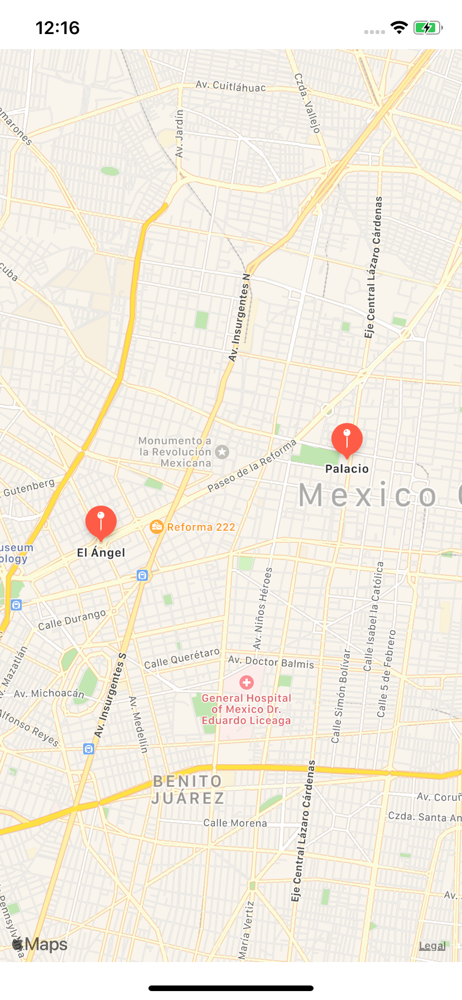
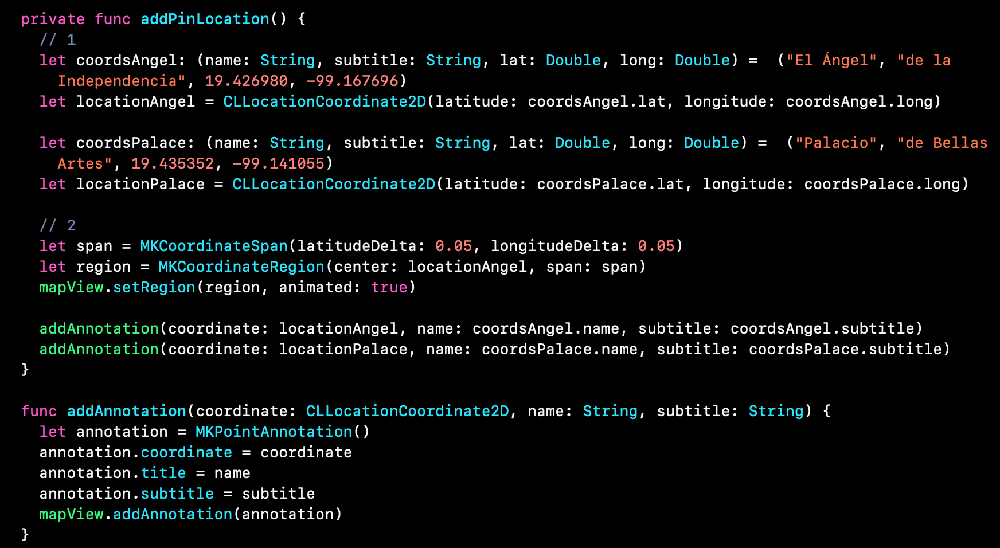

 

`Desarrollo Mobile` > `Swift Fundamentals`
	
## App de Maps 

### OBJETIVO 

- Basado en el Ejemplo-04, aprender como agregar mas Pines de location. Reforzar concepto de variables y tuplas.

#### REQUISITOS 

1. Xcode instalado.

#### DESARROLLO

El proyecto a desarrollar será una app de Mapas en donde se mostrarán dos puntos de ubicación.

Las coordenadas deberán estar basadas en tuplas.

</img>


1.- Nos basamos el el proyecto del Ejemplo 04.

2.- Agregaremos una nueva ubicación. Pero esta vez el nombre y subtitle de la coordenada deberán ir en la tupla.

```
Angel: 19.426980, -99.167696
Palacio de Bellas Artes: 19.435352, -99.141055
```

3.- Creamos una función con los parámetros de coordenada, nombre y subtitle.

4.- Agregamos los pines con dicha función.

<details>
        <summary>Solución</summary>
        <p> Basandonos en el proyecto del ejemplo 04, nos dirigimos al ViewController.swift</p>
        <p>En dicha clase, agregamos las nuevas tuplas de la sig. manera:</p>
        <p><i>let coordsAngel: (name: String, subtitle: String, lat: Double, long: Double) =  ("El Ángel", "de la Independencia", 19.426980, -99.167696) </p> 
    <p>let coordsPalace: (name: String, subtitle: String, lat: Double, long: Double) =  ("Palacio", "de Bellas Artes", 19.435352, -99.141055)
</i></p>
<p>La función para agregar los pines:</p>

<p><i>func addAnnotation(coordinate: CLLocationCoordinate2D, name: String, subtitle: String) {

    let annotation = MKPointAnnotation()
    annotation.coordinate = coordinate
    annotation.title = name
    annotation.subtitle = subtitle
    mapView.addAnnotation(annotation)

  }</i>
</p>
<p> Finalmente agregamos los pines de la sig. manera dentro de la función.
<p> <i>addAnnotation(coordinate: locationAngel, name: coordsAngel.name, subtitle: coordsAngel.subtitle)
    addAnnotation(coordinate: locationPalace, name: coordsPalace.name, subtitle: coordsPalace.subtitle)</i></p>
    

        
</details>
