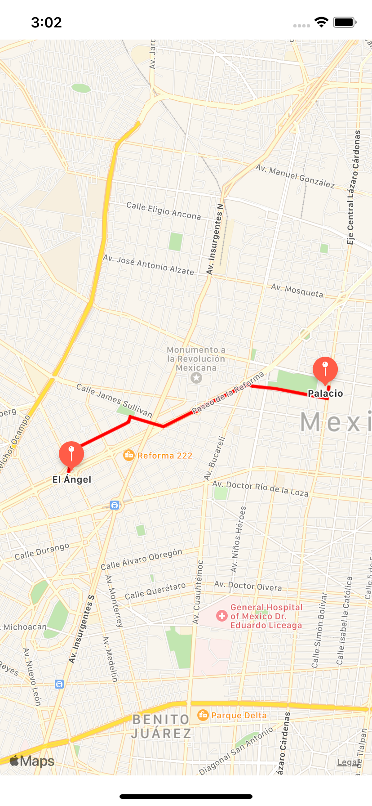

 

`Desarrollo Mobile` > `Swift Fundamentals`
	
## App de Maps con Rutas

### OBJETIVO 

- Crear una app de mapas donde se muestra la ruta entre dos puntos, aplicando los conceptos aprendidos en esta unidad.

#### REQUISITOS 

1. Basarse en el [Template](Template) proporcionado.

#### DESARROLLO

El proyecto a desarrollar será una app de Mapas en donde se mostrarán dos puntos de ubicación y la ruta para llegar de un punto a otro.

</img>

Las coordenadas deberán estar basadas en tuplas.

1.- Agregar dos coordeandas, no muy lejanas como se vio en el Reto-03.

2.- Crear dos variables de tipo CLLocationCoordinate2D
        
3.- Crea dos variables de tipo MKPlacemark, cada una de estas variables debe tener como valor el location correspondiente.
    
4.- Crea dos variables de tipo MKMapItem, estas variables deben tener como valor cada placemark creado.

5.- Centrar el mapa en una region, MKCoordinateRegion.

6.- Agrega los Annotations (pines) del mapa, utiliza la función addAnnotation,
 ejemplo: 

 > addAnnotation(coordinate: locationAngel, name: coordsAngel.name, subtitle: coordsAngel.subtitle)

7.- Crea la ruta, basate en la función `directions()`, para ello necesitaras usar los `MKMapItems`.

> directions(source: sourceMapItem, destination: destinationMapItem)
    

        
Solución

1.- Agregar dos coordeandas, no muy lejanas como se vio en el Reto-03.

    let coordsAngel: (name: String, subtitle: String, lat: Double, long: Double) =  ("El Ángel", "de la Independencia", 19.426980, -99.167696)
    let coordsPalace: (name: String, subtitle: String, lat: Double, long: Double) =  ("Palacio", "de Bellas Artes", 19.435352, -99.141055)

2.- Crear dos variables de tipo CLLocationCoordinate2D

    let locationAngel = CLLocationCoordinate2D(latitude: coordsAngel.lat, longitude: coordsAngel.long)
    let locationPalace = CLLocationCoordinate2D(latitude: coordsPalace.lat, longitude: coordsPalace.long)
    
        
3.- Crea dos variables de tipo MKPlacemark, cada una de estas variables debe tener como valor el location correspondiente.

	let sourcePlacemark = MKPlacemark(coordinate: locationAngel, addressDictionary: nil)
    let destinationPlacemark = MKPlacemark(coordinate: locationPalace, addressDictionary: nil)
    
4.- Crea dos variables de tipo MKMapItem, estas variables deben tener como valor cada placemark creado.

	let sourceMapItem = MKMapItem(placemark: sourcePlacemark)
    let destinationMapItem = MKMapItem(placemark: destinationPlacemark)

5.- Centrar el mapa en una region, MKCoordinateRegion.

	let span = MKCoordinateSpan(latitudeDelta: 0.05, longitudeDelta: 0.05)
    let region = MKCoordinateRegion(center: locationAngel, span: span)
    mapView.setRegion(region, animated: true)

6.- Agrega los Annotations (pines) del mapa, utiliza la función addAnnotation.

	addAnnotation(coordinate: locationAngel, name: coordsAngel.name, subtitle: coordsAngel.subtitle)
    addAnnotation(coordinate: locationPalace, name: coordsPalace.name, subtitle: coordsPalace.subtitle)

7.- Crea la ruta, basate en la función `directions()`, para ello necesitaras usar los `MKMapItems`.

    directions(source: sourceMapItem, destination: destinationMapItem)

            

Ver proyecto [Final](final).
