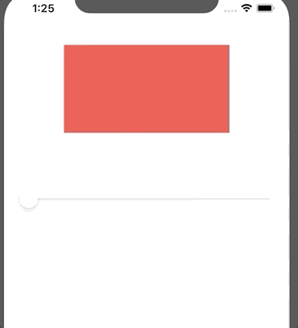
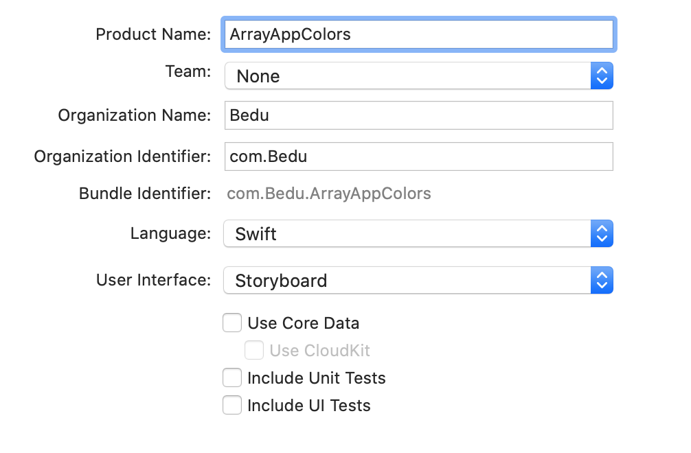
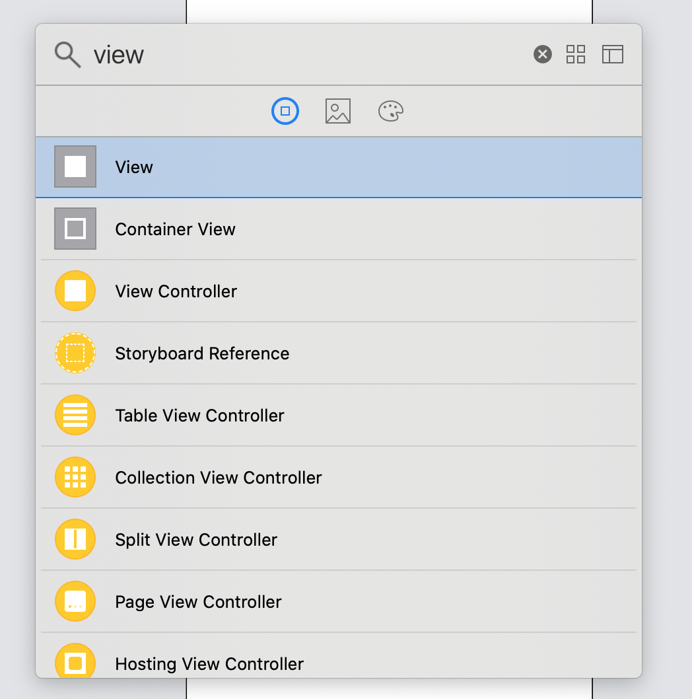
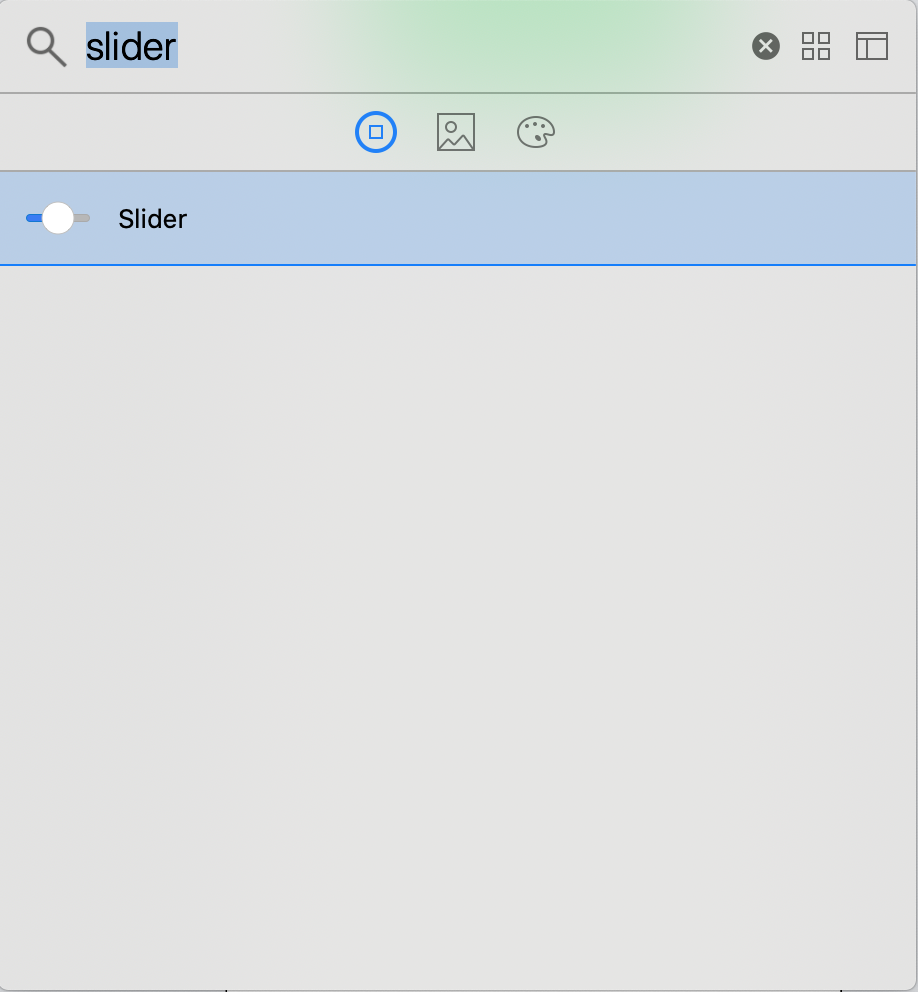
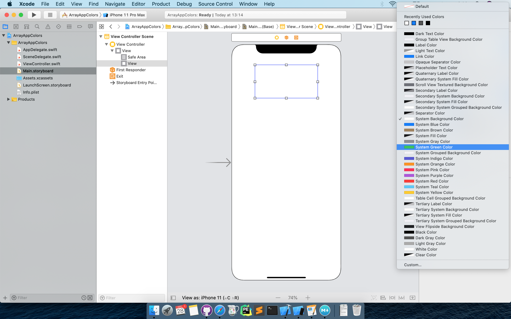
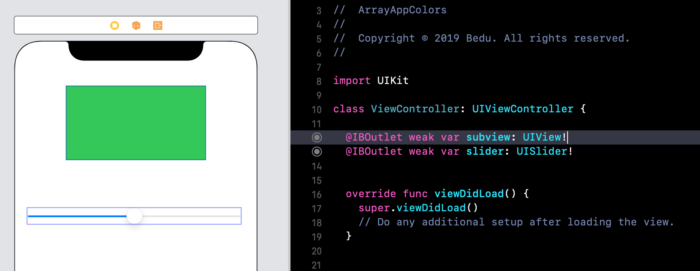

 

`Desarrollo Mobile` > `Swift Fundamentals`
	
## App utlizando Collections

### OBJETIVO 

- Esta reto consiste en crear una app donde se utilice un Array con sus operaciones además de un Slider. Esta app permitirá cambiar el color de un Subview.

#### REQUISITOS 

1. Xcode instalado.

#### DESARROLLO



Crear un proyecto de Xcode



1.- En el Storyboard agregamos un Slider y un View. Al View le cambiamos el color para diferenciarlo del fondo.





2.- Conectamos los elementos con su ViewController.swift.




3.- Crearemos nuestras variables de colores y el Array vacio donde agregaremos los colores

```
  let green = UIColor.green
  let blue = UIColor.blue
  let black = UIColor.black
  let red = UIColor(red: 0.92, green: 0.24, blue: 0.25, alpha: 1.00)
  
  // Empty array
  var colors: [UIColor] = []
```

4.- Dentro de la función ViewDidLoad() agregamos las operaciones de Array. Estas operaciones permiten agregar los colores al Array `colors`.

```
 colors.append(red)
 colors.append(green) 
 colors.append(blue)
 colors.append(black)
```

5.- En esa misma función configuramos el `Slider`.

```
slider.maximumValue = Float(colors.count) - 1
slider.minimumValue = 0.0
slider.value = 1
```

6.- Ahora bien, agregamos una acción a nuestro slider. Este *IBAction* permitirá cambiar el color del Subview.

```
  @IBAction func changeColor(_ sender: Any) {
    let index = Int(slider.value)
    let color = colors[index]
    subview.backgroundColor = color
  }
```

7.- Finalmente ejecutamos la App.


