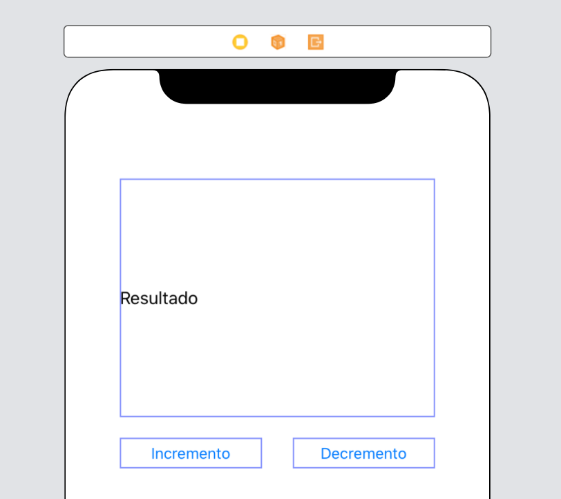
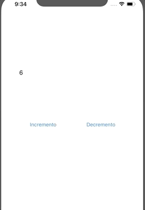

`Desarrollo Mobile` > `Swift Fundamentals`

## Una app simple de incrementos y decrementos

### OBJETIVO

- De acuerdo a lo aprendido anteriormente, crear una app con dos botones y un label que permita crear incrementos y decrementos.

#### REQUISITOS

1. Xcode instalado. Comprender los conceptos de Incrementos y Decrementos. Haber concluido el Ejemplo-02 y Reto-02.

#### DESARROLLO

1.- Crear un proyecto en Xcode con un Layout parecido a este:

2.- Cada botón deberá incrementar/decrementar un contador y además cambiar el tamaño de la letra.

