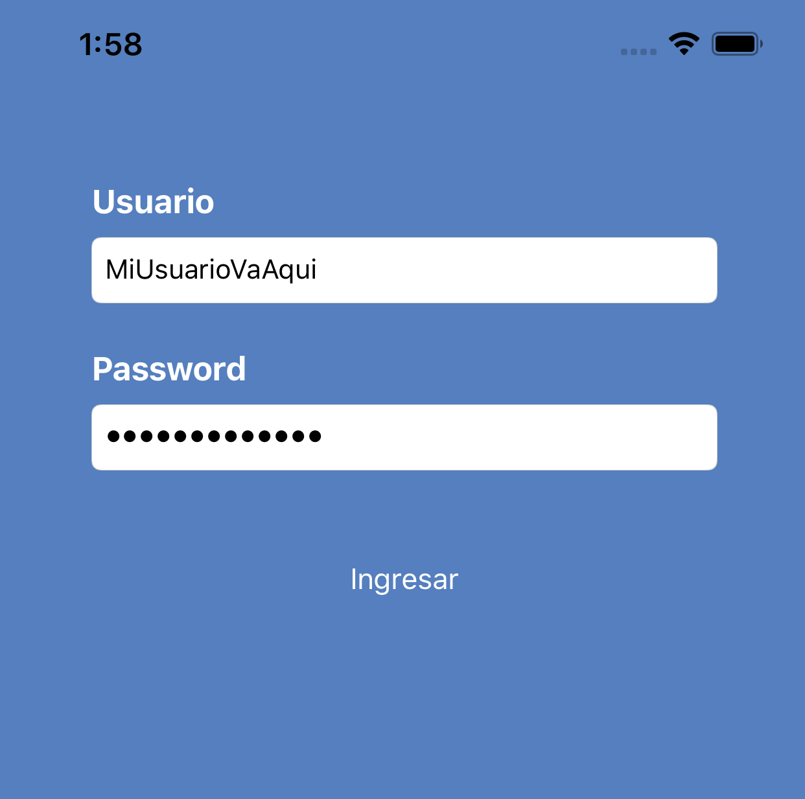
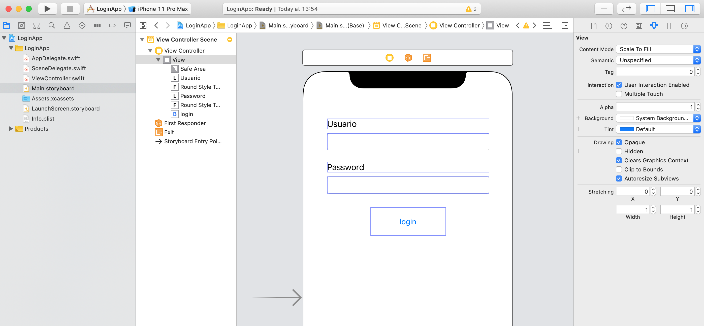
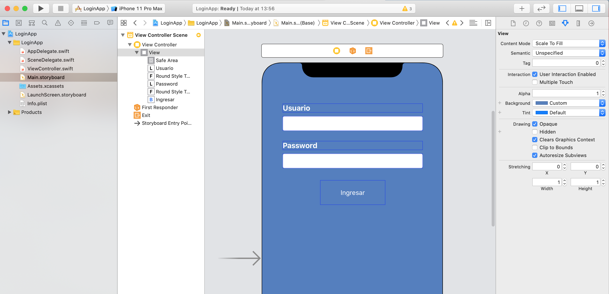
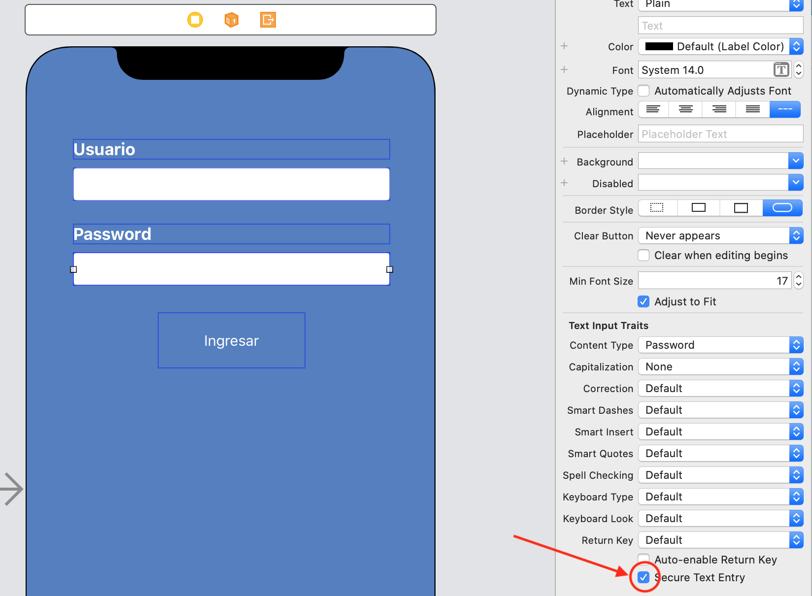
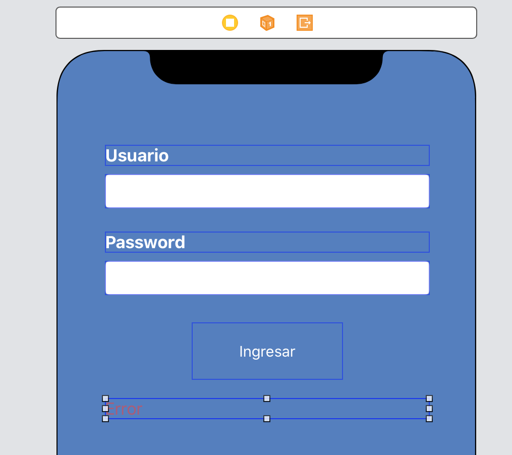
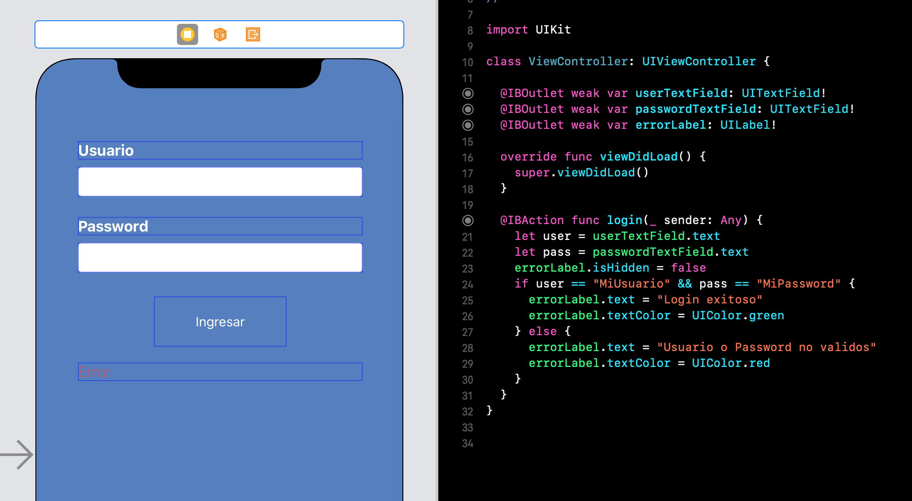
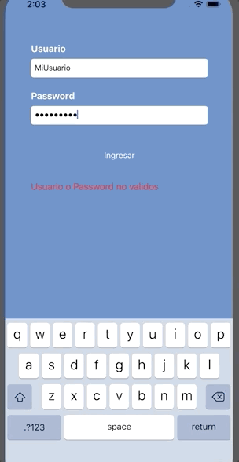

`Desarrollo Mobile` > `Swift Fundamentals`

## App login

### OBJETIVO

- Con lo aprendido hata el momento implementar una app de Login básica.

#### REQUISITOS

1. Xcode.

#### DESARROLLO

1.- Crear un nuevo Proyecto de Xcode y recrear el siguiente layout en el Storyboard.

2.- Personalizar el layout a algo parecido a la imagen.

3.- El Campo de Password lo configuraremos como `Secure Text Entry` para enmascarar el texto.

4.- Agregaremos un Label de error en la parte inferior.

5.- Finalmente conectamos el ViewController con los objetos de UI.

6.- El código debe validar si el usuario y password son identicos al registrado, de ser así mostrar en verde el mensaje de éxito y de no serlo mostrar un mensaje de error en rojo.

